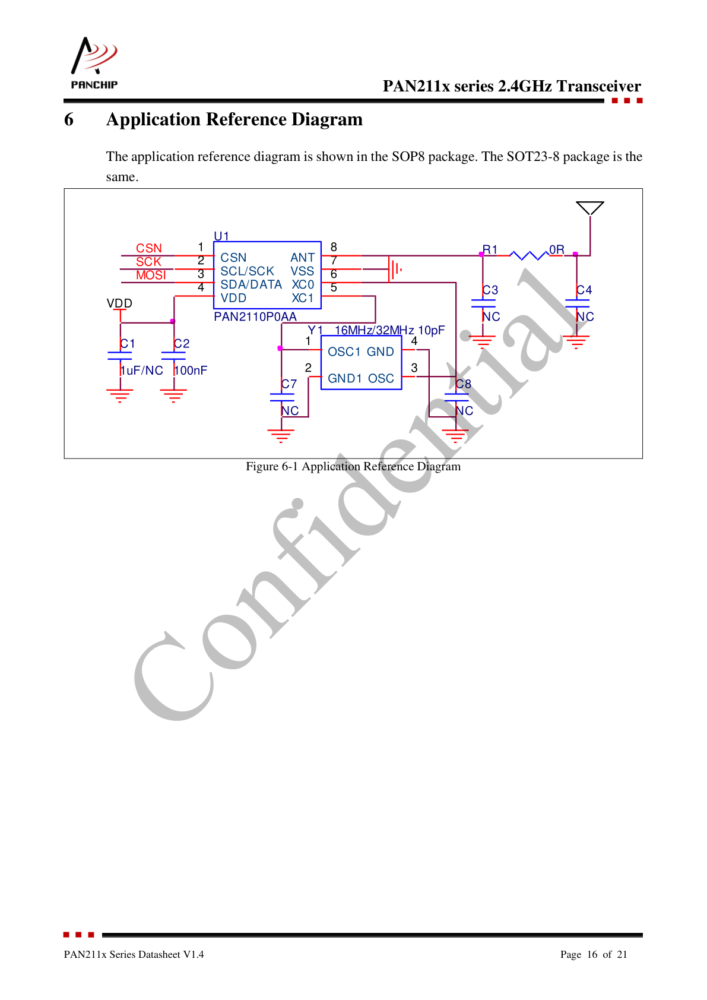
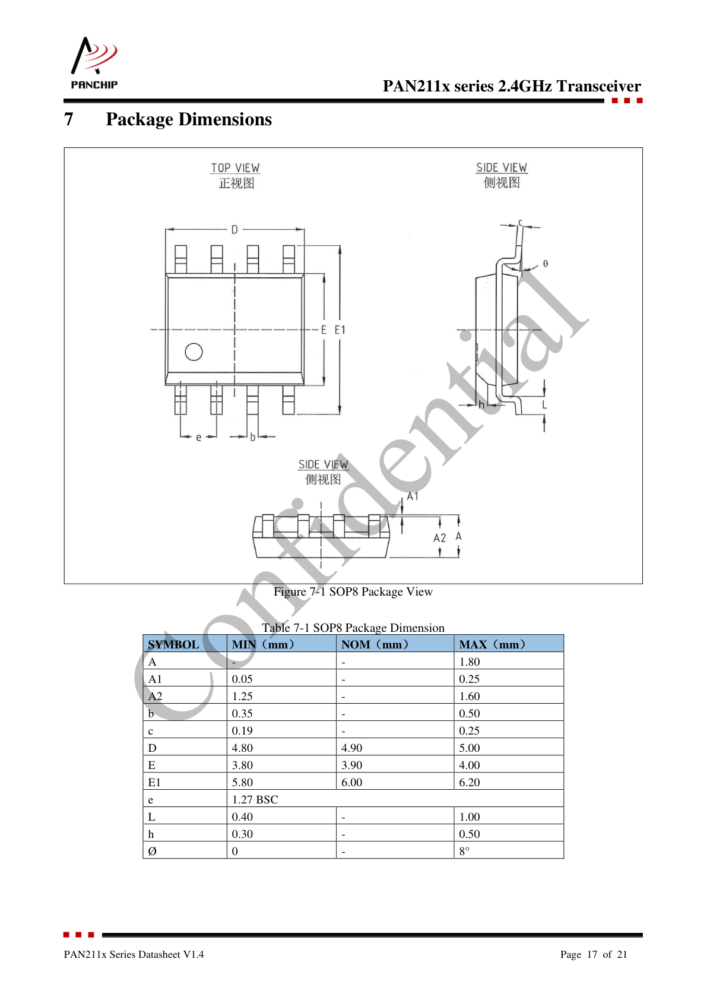
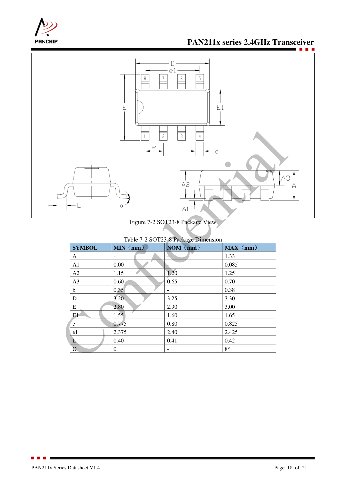

# PAN211x Series 2.4GHz Transceiver Datasheet

**Version:** V1.4
**Date:** March 2025
**Manufacturer:** Panchip Microelectronics Co., Ltd.

---

## Table of Contents

- [1. General Description](#1-general-description)
- [2. Key Features](#2-key-features)
- [3. Typical Applications](#3-typical-applications)
- [4. Naming Rule](#4-naming-rule)
- [5. Ordering Information](#5-ordering-information)
- [6. Block Diagram](#6-block-diagram)
- [7. Pin Information](#7-pin-information)
  - [7.1 Pin Diagram](#71-pin-diagram)
  - [7.2 Pin Descriptions](#72-pin-descriptions)
- [8. Electrical Characteristics](#8-electrical-characteristics)
  - [8.1 RF Characteristics](#81-rf-characteristics)
  - [8.2 TX Characteristics](#82-tx-characteristics)
  - [8.3 RX Characteristics](#83-rx-characteristics)
  - [8.4 RSSI Characteristics](#84-rssi-characteristics)
  - [8.5 RF Timing Characteristics](#85-rf-timing-characteristics)
  - [8.6 RF Power Characteristics](#86-rf-power-characteristics)
  - [8.7 Reset Characteristics](#87-reset-characteristics)
  - [8.8 Clock Characteristics](#88-clock-characteristics)
    - [8.8.1 32MHz HXTAL](#881-32mhz-hxtal)
    - [8.8.2 16MHz HXTAL](#882-16mhz-hxtal)
  - [8.9 General Operating Conditions](#89-general-operating-conditions)
  - [8.10 ESD Characteristics](#810-esd-characteristics)
  - [8.11 Absolute Maximum Ratings](#811-absolute-maximum-ratings)
  - [8.12 Current Characteristics](#812-current-characteristics)
- [9. Application Reference Diagram](#9-application-reference-diagram)
- [10. Package Dimensions](#10-package-dimensions)
  - [10.1 SOP8 Package](#101-sop8-package)
  - [10.2 SOT23-8 Package](#102-sot23-8-package)
- [11. Abbreviations](#11-abbreviations)

---

## 1. General Description

The PAN211x is a low-cost, low-power, highly integrated transceiver that works in the ISM frequency band of 2400MHz ~ 2483MHz. PAN211x has low cost of system application because it only needs one MCU and a few external passive components to build a system to meet the requirements of wireless applications. Moreover, the use of PAN211x is very convenient. It only needs the MCU to configure a few registers of the chip by the SPI/I2C to transmit and receive data.

The PAN211x integrates transmitter, receiver, frequency generator, and GFSK modem. The transmitter power is adjustable (up to 9dBm). The receiver adopts a digital communication mechanism and has good performance of receiving and transmission in complex environments with strong interference.

The PAN211x is compatible with PAN1026, XN297L and Bluetooth-LE data packets. The package of PAN211x is compatible with XN297L (SOP8, 3-wire SPI function).

---

## 2. Key Features

### RF
- **Frequency band:** 2400MHz ~ 2483MHz
- **Data rate:** 2Mbps (only for 32M OSC), 1Mbps, 500kbps, 250kbps, 125kbps, 31.25kbps
- **Modulation:** GFSK
- **Compatibility:** Compatible with PAN1026 / XN297L / Bluetooth-LE packets
- **6 receiving channels** form a 1:6 star network

### RF Synthesis
- Fully integrated synthesizer

### Receiver
- **Sensitivity:**
  - -95dBm @ 1Mbps
  - -88dBm @ 2Mbps
  - -98dBm @ 250kbps
  - -99dBm @ 500kbps
  - -102dBm @ 125kbps

### Transmitter
- Output power is up to 9dBm

### Protocol Engine
- Support up to 128 bytes payload data
- Support automatic retransmission and ACK

### Radio Power Management
- Integrated voltage regulator
- Operating voltage range: 1.8 to 3.6V

### Operating Current
- **Deepsleep mode current:** 300nA
- **Sleep mode current:** 800nA
- **RX current:** 7mA
- **TX current:**
  - 24mA @ 9dBm
  - 10.5mA @ 0dBm (Low Power)

### Host Interface
- Support 3-wire SPI and I2C
- Up to 10Mbps SPI interface rate
- Up to 2Mbps I2C interface rate

### Package
- SOP8 / SOT23-8

### Operating Temperature
- -40 ~ +85°C

### Other Features
- Automatic scrambling and CRC check
- RSSI
- White list filtering of BLE mode
- Fewer external components

---

## 3. Typical Applications

- TV remote control
- Smart home & security
- Wireless mouse & keyboard
- Wireless game controller
- Toys and wireless audio
- Active tag

---

## 4. Naming Rule

```
PAN 2 x P 0 1 x A
│   │ │ │ │ │ │ └─ Temperature range: A = -40~85°C
│   │ │ │ │ │ └─── Pin count: 1 = 8pin
│   │ │ │ │ └───── Flash: 0 = No flash
│   │ │ │ └─────── Package: P = SOP, Z = SOT23-8
│   │ │ └───────── Performance level
│   │ └─────────── 2.4GHz family
│   └───────────── PANCHIP
```

---

## 5. Ordering Information

| Part Number   | Type    | Package | Pin Count | Temperature Range | Packing |
|---------------|---------|---------|-----------|-------------------|---------|
| PAN2110P0AA   | 2.4GHz  | SOP8    | 8         | -40~85°C          | Tube    |
| PAN2110Z0AA   | 2.4GHz  | SOT23-8 | 8         | -40~85°C          | Tube    |

**Note:** Before ordering, please contact the sales window for the latest mass production information.

---

## 6. Block Diagram


The PAN211x integrates the following major functional blocks:

- **RF Receiver Path:**
  - Antenna matching and LNA
  - GFSK demodulator
  - RX FIFO buffer

- **RF Transmitter Path:**
  - GFSK modulator and DAC
  - Power amplifier (PA)
  - TX FIFO buffer

- **Digital Baseband:**
  - Enhanced protocol stack
  - Communication network management
  - Register interface

- **Host Interface:**
  - SPI (3-wire or 4-wire)
  - I2C
  - Interrupt (IRQ)

- **Support Functions:**
  - Crystal oscillator (16MHz or 32MHz)
  - Power management
  - Integrated voltage regulator

---

## 7. Pin Information

### 7.1 Pin Diagram


The chip is available in two package options:
- **SOP8** - Standard 8-pin small outline package
- **SOT23-8** - Compact 8-pin SOT23 package

Both packages share the same pinout.

### 7.2 Pin Descriptions

| Pin No. | Pin Name | Pin Type | Description |
|---------|----------|----------|-------------|
| 1 | CSN | I | The chip select signal of SPI (active low) |
| 2 | SCK/SCL | I | SPI: The clock signal of SPI<br>I2C: The clock signal of I2C |
| 3 | DATA/SDA | I/O | SPI: The data input/output of 3-wire SPI<br>I2C: The data input/output of I2C |
| 4 | VDD | P | Power supply input (1.8V ~ 3.6V) |
| 5 | XC1 | AI | Crystal oscillator input |
| 6 | XC0 | AO | Crystal oscillator output |
| 7 | VSS | G | Ground (GND) |
| 8 | ANT | AI | Antenna interface (RF signal) |

**Pin Type Legend:**
- I: Input
- O: Output
- I/O: Bidirectional
- AI: Analog Input
- AO: Analog Output
- P: Power
- G: Ground

---

## 8. Electrical Characteristics

### 8.1 RF Characteristics

| Parameter | Symbol | Description | Conditions | Min | Typ | Max | Unit |
|-----------|--------|-------------|------------|-----|-----|-----|------|
| Operating frequency | f_OP | | | 2400 | - | 2483 | MHz |
| PLL programming resolution | PLL_res | | | - | 4 | - | Hz |
| Data rate | DR | | | 0.25 | 1 | 2 | Mbps |
| Frequency deviation @ BLE 2Mbps | Δf_BLE,2M | | | - | 500 | - | kHz |
| Frequency deviation @ BLE 1Mbps | Δf_BLE,1M | | | - | 250 | - | kHz |
| Frequency deviation @ BLE 250kbps | Δf_BLE,250k | | | - | 170 | - | kHz |
| Frequency deviation @ 297L mode 2Mbps | Δf_297L,2M | | | - | 500 | - | kHz |
| Frequency deviation @ 297L mode 1Mbps | Δf_297L,1M | | | - | 250 | - | kHz |
| Frequency deviation @ 297L mode 250kbps | Δf_297L,250k | | | - | 170 | - | kHz |
| Channel spacing @ BLE 2Mbps | f_BLE,CS,2M | | | - | 2 | - | MHz |
| Channel spacing @ BLE 1Mbps | f_BLE,CS,1M | | | - | 1 | - | MHz |
| Channel spacing @ BLE 250kbps | f_BLE,CS,250k | | | - | 1 | - | MHz |
| Channel spacing @ 297L mode 2Mbps | f_297L,CS,2M | | | - | 2 | - | MHz |
| Channel spacing @ 297L mode 1Mbps | f_297L,CS,1M | | | - | 1 | - | MHz |
| Channel spacing @ 297L mode 250kbps | f_297L,CS,250k | | | - | 1 | - | MHz |

### 8.2 TX Characteristics

| Parameter | Symbol | Description | Conditions | Min | Typ | Max | Unit |
|-----------|--------|-------------|------------|-----|-----|-----|------|
| Output power | P_RFTX | | | -42 | - | 9 | dBm |
| RF power control range | P_RFC | | | - | 51 | - | dB |
| RF power accuracy | ±3 | | | - | - | - | dB |
| 1st Adjacent Channel TX Power @1Mbps | P_RF1M,1 | | | - | TBD | - | dBc |
| 2nd Adjacent Channel TX Power @1Mbps | P_RF1M,2 | | | - | TBD | - | dBc |
| 3rd Adjacent Channel TX Power @1Mbps | P_RF1M,≥3 | | | - | TBD | - | dBc |
| 1st Adjacent Channel TX Power @2Mbps | P_RF2M,2 | | | - | TBD | - | dBc |
| 2nd Adjacent Channel TX Power @2Mbps | P_RF2M,4 | | | - | TBD | - | dBc |
| ≥3rd Adjacent Channel TX Power @2Mbps | P_RF2M,6 | | | - | TBD | - | dBc |
| 20dB bandwidth @1Mbps | P_BW1M | | | - | 1.2 | - | MHz |
| 20dB bandwidth @2Mbps | P_BW2M | | | - | 2.2 | - | MHz |
| 20dB bandwidth @250kbps | P_BW250k | | | - | 0.7 | - | MHz |
| Spurious @≤1GHz | P_SP,1 | | | - | - | -60 | dBm |
| Spurious @≥1GHz | P_SP,2 | | | - | - | -40 | dBm |

### 8.3 RX Characteristics

| Parameter | Symbol | Description | Conditions | Min | Typ | Max | Unit |
|-----------|--------|-------------|------------|-----|-----|-----|------|
| Receive maximum input power | P_RX,MAX | | | - | - | 10 | dBm |
| Sensitivity, 1Mbps BLE | P_SENS,1M,BLE | | ≤37 bytes, BER = 0.1% | - | -95 | - | dBm |
| Sensitivity, 2Mbps BLE | P_SENS,2M,BLE | | Ideal transmitter | - | -88 | - | dBm |
| Sensitivity, 250kbps | P_SENS,250K | | | - | -98 | - | dBm |
| Sensitivity, 500kbps BLE | P_SENS,1MS2,BLE | | | - | -99 | - | dBm |
| Sensitivity, 125kbps BLE | P_SENS,1MS8,BLE | | | - | -102 | - | dBm |
| Sensitivity, 125kbps | P_SENS,250KS2 | | | - | -101 | - | dBm |
| Sensitivity, 31.25kbps | P_SENS,250KS8 | | | - | -103 | - | dBm |
| Sensitivity, 1Mbps 297L mode | P_SENS,1M,297L | | | - | -95 | - | dBm |
| Sensitivity, 2Mbps 297L mode | P_SENS,2M,297L | | | - | -88 | - | dBm |
| Sensitivity, 250kbps 297L mode | P_SENS,250K,297L | | | - | -98 | - | dBm |
| **Co-Channel interference @1Mbps** | C/I_CO,1M,BLE | | | - | 10 | - | dB |
| Adjacent (1 MHz) interference @1Mbps | C/I_1M,1M,BLE | | | - | -7 | - | dB |
| Adjacent (2 MHz) interference @1Mbps | C/I_2M,1M,BLE | | | - | -35 | - | dB |
| Adjacent (≥3 MHz) interference @1Mbps | C/I_≥3M,1M,BLE | | | - | -39 | - | dB |
| Image frequency interference @1Mbps | C/I_Image,1M,BLE | | | - | -18 | - | dB |
| Adjacent (±1MHz) interference to in-band image @1Mbps | C/I_Image±1M,1M,BLE | | | - | -31 | - | dB |
| Adjacent (≥6 MHz) interference @1Mbps | C/I_≥6M,1M,BLE | | | - | -44 | - | dB |
| **Co-Channel interference @2Mbps** | C/I_CO,2M,BLE | | | - | 9 | - | dB |
| Adjacent (2 MHz) interference @2Mbps | C/I_2M,2M,BLE | | | - | -5 | - | dB |
| Adjacent (4 MHz) interference @2Mbps | C/I_4M,2M,BLE | | | - | -34 | - | dB |
| Adjacent (≥6 MHz) interference @2Mbps | C/I_≥6M,2M,BLE | | | - | -35 | - | dB |
| Image frequency interference @2Mbps | C/I_Image,2M,BLE | | | - | -20 | - | dB |
| Adjacent (±2 MHz) interference to in-band image @2Mbps | C/I_Image±2M,2M,BLE | | | - | -31 | - | dB |
| Adjacent (≥12 MHz) interference @2Mbps | C/I_≥12M,2M,BLE | | | - | -38 | - | dB |

### 8.4 RSSI Characteristics

| Parameter | Symbol | Description | Conditions | Min | Typ | Max | Unit |
|-----------|--------|-------------|------------|-----|-----|-----|------|
| RSSI indication range | RSSI_RFC | | | -90 | - | -20 | dBm |
| RSSI accuracy | RSSI_Auu | | | - | ±2 | - | dB |
| RSSI resolution | RSSI_Res | | | - | 0.25 | - | dB |
| RSSI sample period | RSSI_Per | | | - | 0.25 | - | us |

### 8.5 RF Timing Characteristics

| Parameter | Symbol | Description | Conditions | Min | Typ | Max | Unit |
|-----------|--------|-------------|------------|-----|-----|-----|------|
| 32M crystal oscillator settling time | T_OSC,EN | | | - | 75 | - | us |
| 16M crystal oscillator settling time | T_OSC,EN | | | - | 250 | - | us |
| Time between TXEN task and READY event after channel FREQUENCY configured | T_TX,EN | | | 73 | - | - | us |
| Time between RXEN task and READY event after channel FREQUENCY configured in default mode | T_RX,EN | | | 64 | - | - | us |
| Time between DISABLE task and DISABLED event when the radio was in TX | T_TX,DISABLE | | | 5 | - | - | us |
| Time between DISABLE task and DISABLED event when the radio was in RX | T_RX,DISABLE | | | 5 | - | - | us |
| The time taken to switch from TX to RX | T_TX-RX | | | 67 | - | - | us |
| The time taken to switch from RX to TX | T_RX-TX | | | 75 | - | - | us |

### 8.6 RF Power Characteristics

| Parameter | Symbol | Description | Conditions | Min | Typ | Max | Unit |
|-----------|--------|-------------|------------|-----|-----|-----|------|
| TX only run current 9dBm | I_TX,P9dBm | | | - | 25 | - | mA |
| TX only run current 8dBm | I_TX,P8dBm | | | - | 23 | - | mA |
| TX only run current 7dBm | I_TX,P7dBm | | | - | 21.5 | - | mA |
| TX only run current 6dBm | I_TX,P6dBm | | | - | 21.4 | - | mA |
| TX only run current 5dBm | I_TX,P5dBm | | | - | 20 | - | mA |
| TX only run current 4dBm | I_TX,P4dBm | | | - | 19 | - | mA |
| TX only run current 3dBm | I_TX,P3dBm | | | - | 19.1 | - | mA |
| TX only run current 2dBm | I_TX,P2dBm | | | - | 18.5 | - | mA |
| TX only run current 1dBm | I_TX,P1dBm | | | - | 17.5 | - | mA |
| TX only run current 0dBm (default) | I_TX,P0dBm | | | - | 17 | - | mA |
| TX only run current 0dBm (low power) | I_TX,P0dBm | | | - | 10.5 | - | mA |
| TX only run current -5dBm | I_TX,P-5dBm | | | - | 9.5 | - | mA |
| TX only run current -8dBm | I_TX,P-8dBm | | | - | 8.7 | - | mA |
| TX only run current -14dBm | I_TX,P-14dBm | | | - | 7.2 | - | mA |
| TX only run current -19dBm | I_TX,P-19dBm | | | - | 6.1 | - | mA |
| TX only run current -25dBm | I_TX,P-25dBm | | | - | 5.3 | - | mA |
| TX only run current -40dBm | I_TX,P-40dBm | | | - | 4.5 | - | mA |
| RX 1Mbps current | I_RX,1M | | | - | 7 | - | mA |
| RX 2Mbps current | I_RX,2M | | | - | 7.9 | - | mA |
| RX 250kbps current | I_RX,250K | | | - | 7.1 | - | mA |

### 8.7 Reset Characteristics

| Parameter | Symbol | Description | Conditions | Min | Typ | Max | Unit |
|-----------|--------|-------------|------------|-----|-----|-----|------|
| Negative threshold voltage, nRESET | V_ILR | | VDD=1.8V-3.3V, T_A=25°C | - | - | 0.22×VDD | V |
| Positive threshold voltage, nRESET | V_IHR | | VDD=1.8V-3.3V, T_A=25°C | 0.48×VDD | - | - | V |
| Schmitt Trigger Voltage Hysteresis nRESET | V_hys_rst | | VDD=1.8V-3.3V, T_A=25°C | - | - | 0.26×VDD | V |
| nRESET pin internal pull-up resistor | R_RST | | VDD=3.3V, T_A=25°C | - | 51 | - | kΩ |
| nRESET pin input filter pulse time | t_FR,0.3pF | | VDD=3.3V, T_A=25°C | - | TBD | - | ns |

### 8.8 Clock Characteristics

#### 8.8.1 32MHz HXTAL

| Parameter | Symbol | Description | Conditions | Min | Typ | Max | Unit |
|-----------|--------|-------------|------------|-----|-----|-----|------|
| High speed crystal oscillator (HXTAL) frequency | f_HXTLA | | VDD=3.3V, T_A=25°C | - | 32 | - | MHz |
| Crystal load capacitance | C_LoadHXTLA | | VDD=3.3V, T_A=25°C | 7 | 10 | 12 | pF |
| HXTAL oscillator operating current | I_DDHXTLA | | VDD=3.3V, T_A=25°C | - | 250 | - | μA |
| HXTAL oscillator startup time | t_SUHXTLA | | VDD=3.3V, T_A=25°C, ESR=40Ω, C_HXTL=10pF | - | 300 | - | μs |
| HXTAL oscillator Quick startup time | t_SUHXTL Quick | | VDD=3.3V, T_A=25°C, ESR=40Ω, C_HXTL=10pF | - | 75 | - | μs |
| Equivalent series resistance | ESR_HXTLA | | | - | 40 | 100 | Ω |
| Frequency tolerance for the crystal | F_TOLHXTLA | | VDD=3.3V, T_A=25°C | -20 | - | 20 | ppm |
| Drive level | PD_HXTLA | | VDD=3.3V, T_A=25°C | - | - | 100 | μW |

#### 8.8.2 16MHz HXTAL

| Parameter | Symbol | Description | Conditions | Min | Typ | Max | Unit |
|-----------|--------|-------------|------------|-----|-----|-----|------|
| High speed crystal oscillator (HXTAL) frequency | f_HXTLA | | VDD=3.3V, T_A=25°C | - | 16 | - | MHz |
| Crystal load capacitance | C_LoadHXTLA | | VDD=3.3V, T_A=25°C | 7 | 10 | 12 | pF |
| HXTAL oscillator operating current | I_DDHXTLA | | VDD=3.3V, T_A=25°C | - | 210 | - | μA |
| HXTAL oscillator startup time | t_SUHXTLA | | VDD=3.3V, T_A=25°C, ESR=40Ω, C_HXTL=10pF | - | 600 | - | μs |
| HXTAL oscillator Quick startup time | t_SUHXTL Quick | | VDD=3.3V, T_A=25°C, ESR=40Ω, C_HXTL=10pF | - | 250 | - | μs |
| Equivalent series resistance | ESR_HXTLA | | | - | 40 | 100 | Ω |
| Frequency tolerance for the crystal | F_TOLHXTLA | | VDD=3.3V, T_A=25°C | -20 | - | 20 | ppm |
| Drive level | PD_HXTLA | | VDD=3.3V, T_A=25°C | - | - | 100 | μW |

> **Note — firmware init differences for 16 MHz crystal:** The PAN211x SDK targets a 32 MHz crystal. A 16 MHz crystal requires additional register writes during `Init()` not present in the SDK:
> - Page 0 `0x37 = 0xE0` before entering Page 1.
> - Page 1 `0x3F = 0xD2`, `0x40 = 0x20` (undocumented RF tuning).
> - Page 1 `0x41 (VCO_PA_CTL) = 0xA6` instead of the SDK's `0xA2`.

### 8.9 General Operating Conditions

| Parameter | Symbol | Description | Conditions | Min | Typ | Max | Unit |
|-----------|--------|-------------|------------|-----|-----|-----|------|
| Operating voltage | VDD | | T_A=25°C | 1.8 | - | 3.6 | V |
| Storage temperature | T_ST | | | -65 | - | 150 | °C |
| Ambient temperature | T_A | | | -40 | - | 85 | °C |
| Junction temperature | T_J | | | -40 | - | 125 | °C |
| Thermal resistance (SOP8) | R_θJA-SOP8 | | | - | 41 | - | °C/W |

### 8.10 ESD Characteristics

| Parameter | Symbol | Description | Conditions | Min | Typ | Max | Unit |
|-----------|--------|-------------|------------|-----|-----|-----|------|
| ESD @ Human Body Mode | V_ESDHBM | ANSI/ESDA/JEDEC JS-001 | T_A=25°C | - | ±4 | - | kV |
| ESD @ Charge Device Mode | V_ESDCDM | ANSI/ESDA/JEDEC JS-002 | T_A=25°C | - | ±1000 | - | V |
| ESD @ Machine Mode | V_ESDMM | JESD22-A115-C | T_A=25°C | - | ±200 | - | V |
| Latch up current | I_latchup | JEDEC EIA/JESD78 | T_A=25°C | - | ±500 | - | mA |

### 8.11 Absolute Maximum Ratings

| Parameter | Symbol | Description | Conditions | Min | Typ | Max | Unit |
|-----------|--------|-------------|------------|-----|-----|-----|------|
| Supply voltages | VDD - VSS | | T_A=25°C | -0.3 | - | 3.6 | V |
| I/O pin voltage | V_IN | | T_A=25°C | VSS-0.3 | - | VDD+0.3 | V |
| Extreme power consumption | P_VDD | | VDD=3.3V, T_A=25°C | - | 120 | - | mW |

**WARNING:** Stresses beyond those listed under "Absolute Maximum Ratings" may cause permanent damage to the device. This is a stress rating only and functional operation of the device at these or any other conditions beyond those indicated in the operational sections of this specification is not implied. Exposure to absolute maximum rating conditions for extended periods may affect device reliability.

### 8.12 Current Characteristics

| Symbol | Description | Conditions | Typ | Unit |
|--------|-------------|------------|-----|------|
| Deepsleep | Deep sleep mode current | VDD=3.3V, T_A=25°C | 0.3 | μA |
| Sleep | Sleep mode current | VDD=3.3V, T_A=25°C | 0.8 | μA |
| STB1 | Standby mode 1 current | VDD=3.3V, T_A=25°C | 160 | μA |
| STB2 | Standby mode 2 current | VDD=3.3V, T_A=25°C | 590 | μA |
| STB3 | Standby mode 3 current | VDD=3.3V, T_A=25°C | 850 | μA |

---

## 9. Application Reference Diagram



### Bill of Materials (BOM)

| Reference | Component | Value/Part Number | Description |
|-----------|-----------|-------------------|-------------|
| U1 | IC | PAN2110P0AA | 2.4GHz Transceiver |
| Y1 | Crystal | 16MHz or 32MHz | 10pF load capacitance, ESR ≤ 100Ω |
| R1 | Resistor | 0Ω | CSN pull-up (optional) |
| C1, C2 | Capacitor | 10pF | Crystal load capacitors |
| C3, C4 | Capacitor | 10pF | Crystal load capacitors |
| C7 | Capacitor | 100nF | VDD decoupling |
| C8 | Capacitor | 1μF or NC | Additional VDD decoupling (optional) |

### Design Notes

1. **Crystal Selection:**
   - Use either 16MHz or 32MHz crystal
   - 32MHz crystal required for 2Mbps data rate
   - ESR should be ≤ 100Ω (typical 40Ω)
   - Load capacitance: 7-12pF (typical 10pF)

2. **Power Supply Decoupling:**
   - Place 100nF ceramic capacitor as close as possible to VDD pin
   - Optional 1μF capacitor for additional filtering
   - Use low-ESR ceramic capacitors (X7R or X5R)

3. **Crystal Load Capacitors:**
   - C1, C2, C3, C4 = 10pF typical
   - Adjust based on crystal specification and PCB parasitic capacitance
   - Formula: C_L = (C1 × C2) / (C1 + C2) + C_stray

4. **PCB Layout Recommendations:**
   - Keep crystal and load capacitors close to XC0/XC1 pins
   - Use ground plane under crystal
   - Minimize trace length on RF path (ANT pin)
   - Keep digital signals away from RF and crystal circuits

5. **Antenna Matching:**
   - ANT pin impedance is typically 50Ω
   - Matching network may be required depending on antenna type
   - Pi or T matching network recommended for best performance

---

## 10. Package Dimensions

### 10.1 SOP8 Package



#### SOP8 Package Dimensions

| Symbol | MIN (mm) | NOM (mm) | MAX (mm) |
|--------|----------|----------|----------|
| A | - | - | 1.80 |
| A1 | 0.05 | - | 0.25 |
| A2 | 1.25 | - | 1.60 |
| b | 0.35 | - | 0.50 |
| c | 0.19 | - | 0.25 |
| D | 4.80 | 4.90 | 5.00 |
| E | 3.80 | 3.90 | 4.00 |
| E1 | 5.80 | 6.00 | 6.20 |
| e | 1.27 BSC | 1.27 BSC | 1.27 BSC |
| L | 0.40 | - | 1.00 |
| h | 0.30 | - | 0.50 |
| θ | 0° | - | 8° |

**Note:** BSC = Basic Spacing between Centers (nominal dimension)

### 10.2 SOT23-8 Package



#### SOT23-8 Package Dimensions

| Symbol | MIN (mm) | NOM (mm) | MAX (mm) |
|--------|----------|----------|----------|
| A | - | - | 1.33 |
| A1 | 0.00 | - | 0.085 |
| A2 | 1.15 | 1.20 | 1.25 |
| A3 | 0.60 | 0.65 | 0.70 |
| b | 0.35 | - | 0.38 |
| D | 3.20 | 3.25 | 3.30 |
| E | 2.80 | 2.90 | 3.00 |
| E1 | 1.55 | 1.60 | 1.65 |
| e | 0.775 | 0.80 | 0.825 |
| e1 | 2.375 | 2.40 | 2.425 |
| L | 0.40 | 0.41 | 0.42 |
| θ | 0° | - | 8° |

---

## 11. Abbreviations

| Abbreviation | Full Name |
|--------------|-----------|
| ADC | Analog-to-Digital Converter |
| BLE | Bluetooth Low Energy |
| CAD | Channel Activity Detection |
| Chirp | Linear Frequency Modulation |
| CRC | Cyclic Redundancy Check |
| CSN | SPI Chip Select Signal (active low) |
| DAC | Digital-to-Analog Converter |
| DCDC | DC-to-DC Converter |
| FIFO | First Input First Output |
| GPIO | General-Purpose Input/Output |
| IRQ | Interrupt Request |
| LDO | Low Dropout Regulator |
| LPF | Low Pass Filter |
| MAC | Media Access Control Layer |
| MCU | Micro Control Unit |
| OSC | Oscillator |
| PA | Power Amplifier |
| RF | Radio Frequency |
| PLL | Phase Locked Loop |
| PMU | Power Management Unit |
| POR | Power-on Reset |
| RAM | Random Access Memory |
| RSSI | Received Signal Strength Indication |
| SCK | SPI Serial Clock |
| SF | Spreading Factor |
| SPI | Serial Peripheral Interface |
| STB | Standby Mode |
| Sync | Synchronization |
| VCO | Voltage Controlled Oscillator |

---

## Document Information

This is a translation from the original PDF version:

**Copyright © 2025 Panchip Microelectronics Co., Ltd.**

**Contact Information:**
- Company: Shanghai Panchip Microelectronics Co., Ltd.
- Address: Room 302, Building D, No. 666 Shengxia Road, Zhangjiang Hi-Tech Park, Shanghai, China
- Phone: 021-50802371
- Website: http://www.panchip.com

**Revision History:**

| Version | Date | Content |
|---------|------|---------|
| V1.0 | 2024.09 | Initial release |
| V1.1 | 2024.11 | Update the Application Reference Diagram |
| V1.2 | 2025.01 | Update the Electrical Characteristics, Ordering information |
| V1.3 | 2025.02 | Update the Application Reference Diagram |
| V1.4 | 2025.03 | Add the SOT23-8 package. Update the value of P_RX,MAX |

---

**DISCLAIMER**

The information in this document is subject to change without notice. Every effort has been made in the preparation of this document to ensure the accuracy of the contents, but all statements, information, and recommendations in this document do not constitute a warranty of any kind, express or implied.

All or part of the products, services and features described in this document may not be within the purchase scope or the usage scope. Unless otherwise specified in the contract, all statements, information, and recommendations in this document are provided "AS IS" without warranties, guarantees or representations of any kind, either express or implied.
