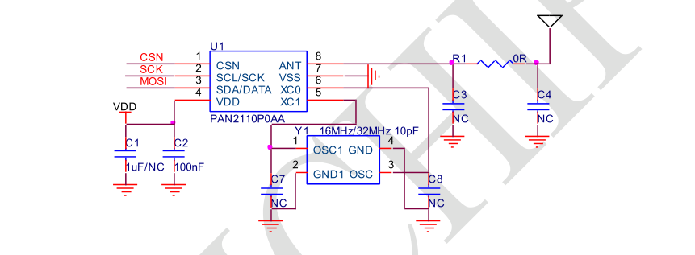
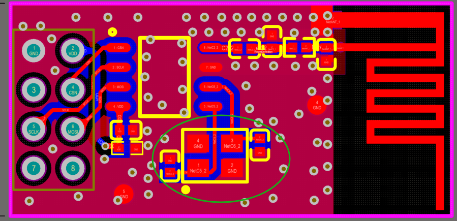
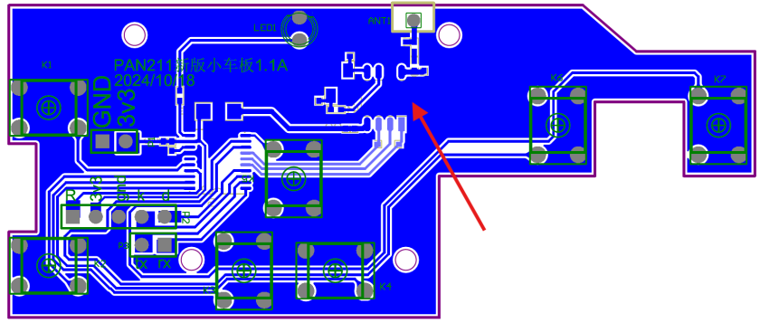
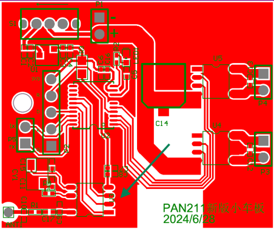
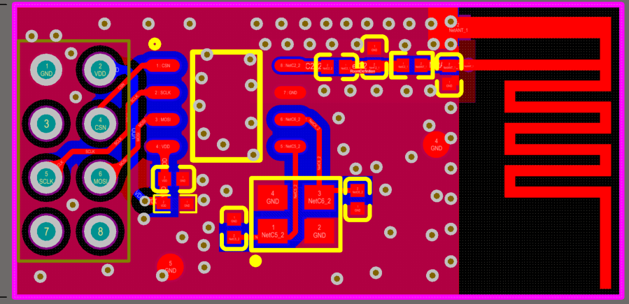
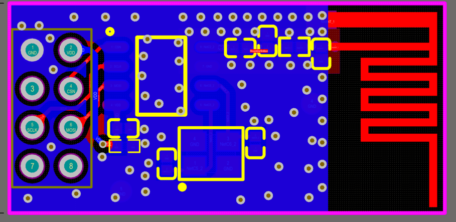

# PAN211x Hardware Design Reference

**Version:** V1.2
**Release Date:** July 2025
**Manufacturer:** Shanghai Panchip Microelectronics Co., Ltd.

---

## Table of Contents

- [1. Schematic Design](#1-schematic-design)
  - [1.1 Reference Schematic](#11-reference-schematic)
    - [1.1.1 SOP8 Reference Schematic](#111-sop8-reference-schematic)
    - [1.1.2 Bill of Materials](#112-bill-of-materials)
  - [1.2 Power Supply Circuit](#12-power-supply-circuit)
  - [1.3 Crystal Circuit](#13-crystal-circuit)
    - [1.3.1 Recommended Crystal Parameters](#131-recommended-crystal-parameters)
    - [1.3.2 Internal Capacitor Frequency Adjustment Range](#132-internal-capacitor-frequency-adjustment-range)
  - [1.4 Antenna Matching Circuit](#14-antenna-matching-circuit)
  - [1.5 SPI/I2C Interface Circuit](#15-spii2c-interface-circuit)
- [2. PCB Design](#2-pcb-design)
  - [2.1 PCB Material and Stackup Design](#21-pcb-material-and-stackup-design)
  - [2.2 Power and Ground Layout](#22-power-and-ground-layout)
  - [2.3 Crystal Layout](#23-crystal-layout)
  - [2.4 SPI/I2C Interface Layout](#24-spii2c-interface-layout)
  - [2.5 RF Matching Circuit Layout](#25-rf-matching-circuit-layout)
  - [2.6 Antenna Layout](#26-antenna-layout)
  - [2.7 ESD Protection](#27-esd-protection)
  - [2.8 PCB Layout Examples](#28-pcb-layout-examples)

---

## 1. Schematic Design

### 1.1 Reference Schematic

#### 1.1.1 SOP8 Reference Schematic

**Figure 1:** PAN211x SOP8 Package Reference Schematic

The reference schematic shows a minimal application circuit with:
- Power supply decoupling capacitors (C1, C2)
- 32MHz or 16MHz crystal oscillator (Y1)
- Optional antenna matching components
- SPI/I2C interface connections

#### 1.1.2 Bill of Materials

| Reference | Value | Package | Description | Quantity |
|-----------|-------|---------|-------------|----------|
| C1 | 1μF | 0402 | NPO, ±10%, 16V | 1 |
| C2 | 100nF | 0402 | NPO, ±10%, 16V | 1 |
| R1 | 0Ω/4pF | 0402 | For PIFA antenna, use 4pF capacitor | 1 |
| Y1 | 32MHz | 3225 | Frequency tolerance ±10ppm; Load capacitance 10pF | 1 |
| C3, C4, C7, C8 | NC | - | Not connected (optional external load capacitors) | - |

**Notes:**
1. For modules without FCC/CE certification using PIFA antenna, a series capacitor (4pF) to the antenna is required to avoid high-power self-oscillation.
2. For FCC/CE certification, at least reserve a Pi-type matching structure. Component values should refer to the regulatory compliance design document.

---

### 1.2 Power Supply Circuit

The integrity of the power supply design affects chip performance. A good power supply design makes it easier to maximize wireless module performance.

#### Power Supply Requirements

- **Voltage Range:** 1.8V - 3.6V
- **Ripple:** Less than ±100mV
- **Ripple Frequency:** Less than 1MHz

#### Design Guidelines

1. **Current Margin:**
   - Output current capability should be greater than 2× peak current under normal conditions
   - Minimum 1.5× peak current if current margin is limited

2. **Ripple Management:**
   - In 3.3V supply systems, excessive ripple can couple through wires or ground plane to sensitive circuits
   - Sensitive signals include: antenna, feedlines, clock lines, and other critical RF signals
   - Excessive ripple degrades RF performance

3. **DC-DC Converter Usage:**
   - Wait for output voltage to stabilize after DC-DC enable before configuring the RF chip
   - After entering Deep Sleep mode, the DC-DC enable signal can be pulled low to reduce module base current

---

### 1.3 Crystal Circuit

#### 1.3.1 Recommended Crystal Parameters

1. **Crystal Frequency:** 32MHz or 16MHz
2. **ESR (Equivalent Series Resistance):** Less than 80Ω
3. **Crystal Load Capacitance:** 10pF
4. **Frequency Tolerance:** Within ±20ppm

#### 1.3.2 Internal Capacitor Frequency Adjustment Range

According to measurements with recommended crystal parameters, the internal capacitor can adjust frequency deviation by approximately ±140kHz. Different crystals and PCBs will have variations.

**Recommendation:** Reserve external capacitor positions C7 and C8. If the crystal frequency deviation is large, these capacitors can be used to adjust the frequency offset.

#### Frequency Adjustment Test Data

The table below shows carrier frequency changes in single carrier mode at 2440MHz when adjusting the internal capacitors. Red text indicates default configuration. PCB is FR4 double-sided board. Different board materials and crystals will have different results. Test data is for reference only.

**Test Conditions:**
- Mode: Single carrier
- Frequency point: 2440MHz
- PCB: FR4 double-sided board

**Crystal Specifications Tested** — Carrier frequency variation (MHz) with internal capacitor adjustment for different crystal types. Bold row indicates default configuration.

| FSYNXO_CAP2 | FSYNXO_CAPSEL | SMD2016 8pF, ±10ppm | SMD3225 8pF, ±10ppm ESR≤40Ω | SMD3225 9pF, ±10ppm ESR≤40Ω | SMD3225 10pF, ±10ppm ESR≤50Ω | SMD3225 12pF, ±10ppm ESR≤40Ω | SMD3225 16pF, ±10ppm ESR≤40Ω | SMD3225 18pF, ±10ppm ESR≤40Ω | SMD3225 20pF, ±10ppm ESR≤80Ω | DIP-49S 10pF, ±20ppm ESR≤30Ω | DIP-49S 12pF, ±20ppm ESR≤30Ω | DIP-49S 20pF, ±20ppm ESR≤30Ω |
|---|---|---|---|---|---|---|---|---|---|---|---|---|
| 0 | 000000 | 2440.044 | 2440.035 | 2440.120 | 2440.228 | 2440.219 | 2440.303 | 2440.332 | 2440.320 | 2440.306 | 2440.457 | 2440.654 |
| 0 | 000001 | 2440.040 | 2440.029 | 2440.113 | 2440.221 | 2440.212 | 2440.297 | 2440.326 | 2440.314 | 2440.294 | 2440.444 | 2440.642 |
| 0 | 000010 | 2440.036 | 2440.022 | 2440.105 | 2440.214 | 2440.205 | 2440.291 | 2440.319 | 2440.308 | 2440.281 | 2440.431 | 2440.631 |
| 0 | 000100 | 2440.028 | 2440.010 | 2440.092 | 2440.201 | 2440.193 | 2440.279 | 2440.307 | 2440.297 | 2440.257 | 2440.407 | 2440.609 |
| 0 | 001000 | 2440.014 | 2439.986 | 2440.067 | 2440.177 | 2440.171 | 2440.256 | 2440.285 | 2440.276 | 2440.220 | 2440.361 | 2440.568 |
| 0 | 010000 | 2439.989 | 2439.944 | 2440.024 | 2440.135 | 2440.129 | 2440.216 | 2440.245 | 2440.239 | 2440.141 | 2440.278 | 2440.492 |
| **0** | **100000 (default)** | **2439.947** | **2439.876** | **2439.953** | **2440.066** | **2440.066** | **2440.150** | **2440.181** | **2440.176** | **2440.002** | **2440.135** | **2440.362** |
| 0 | 100001 | 2439.946 | 2439.872 | 2439.949 | 2440.062 | 2440.062 | 2440.148 | 2440.178 | 2440.175 | 2439.995 | 2440.128 | 2440.356 |
| 0 | 100010 | 2439.943 | 2439.868 | 2439.945 | 2440.058 | 2440.058 | 2440.144 | 2440.174 | 2440.171 | 2439.988 | 2440.120 | 2440.349 |
| 0 | 100100 | 2439.939 | 2439.861 | 2439.938 | 2440.051 | 2440.050 | 2440.138 | 2440.168 | 2440.165 | 2439.973 | 2440.105 | 2440.335 |
| 0 | 101000 | 2439.932 | 2439.848 | 2439.924 | 2440.038 | 2440.037 | 2440.125 | 2440.155 | 2440.154 | 2439.946 | 2440.076 | 2440.309 |
| 0 | 110000 | 2439.917 | 2439.824 | 2439.899 | 2440.013 | 2440.015 | 2440.102 | 2440.133 | 2440.132 | 2439.896 | 2440.023 | 2440.260 |
| 0 | 111000 | 2439.905 | 2439.802 | 2439.877 | 2439.992 | 2439.994 | 2440.082 | 2440.113 | 2440.113 | 2439.850 | 2439.974 | 2440.215 |
| 0 | 111100 | 2439.899 | 2439.792 | 2439.866 | 2439.982 | 2439.985 | 2440.072 | 2440.103 | 2440.105 | 2439.828 | 2439.952 | 2440.194 |
| 0 | 111111 | 2439.895 | 2439.785 | 2439.859 | 2439.975 | 2439.978 | 2440.066 | 2440.097 | 2440.099 | 2439.813 | 2439.936 | 2440.180 |
| 1 | 000000 | 2439.960 | 2439.896 | 2439.973 | 2440.086 | 2440.083 | 2440.170 | 2440.200 | 2440.195 | 2440.043 | 2440.178 | 2440.402 |
| 1 | 000100 | 2439.950 | 2439.880 | 2439.956 | 2440.070 | 2440.068 | 2440.155 | 2440.185 | 2440.182 | 2440.011 | 2440.145 | 2440.372 |
| 1 | 001000 | 2439.942 | 2439.866 | 2439.941 | 2440.055 | 2440.055 | 2440.142 | 2440.172 | 2440.169 | 2439.982 | 2440.114 | 2440.344 |
| 1 | 010000 | 2439.926 | 2439.839 | 2439.914 | 2440.029 | 2440.030 | 2440.117 | 2440.147 | 2440.146 | 2439.928 | 2440.057 | 2440.292 |
| 1 | 100000 | 2439.900 | 2439.795 | 2439.868 | 2439.984 | 2439.987 | 2440.075 | 2440.106 | 2440.107 | 2439.833 | 2439.958 | 2440.200 |
| 1 | 100100 | 2439.895 | 2439.785 | 2439.858 | 2439.975 | 2439.978 | 2440.066 | 2440.097 | 2440.098 | 2439.812 | 2439.935 | 2440.180 |
| 1 | 101000 | 2439.890 | 2439.776 | 2439.849 | 2439.965 | 2439.969 | 2440.057 | 2440.088 | 2440.091 | 2439.793 | 2439.915 | 2440.161 |
| 1 | 110000 | 2439.880 | 2439.759 | 2439.832 | 2439.949 | 2439.953 | 2440.041 | 2440.073 | 2440.076 | 2439.756 | 2439.875 | 2440.125 |
| 1 | 111100 | 2439.867 | 2439.736 | 2439.809 | 2439.926 | 2439.932 | 2440.020 | 2440.052 | 2440.057 | 2439.706 | 2439.822 | 2440.077 |
| 1 | 111111 | 2439.864 | 2439.731 | 2439.804 | 2439.921 | 2439.928 | 2440.015 | 2440.047 | 2440.052 | 2439.695 | 2439.810 | 2440.066 |

The internal capacitor adjustment provides fine-tuning of ±140kHz around the center frequency. The FSYNXO_CAP2 and FSYNXO_CAPSEL registers control the internal capacitance to adjust the crystal oscillator frequency.

**Default Configuration:** FSYNXO_CAP2=0, FSYNXO_CAPSEL=100000

---

### 1.4 Antenna Matching Circuit

Antenna matching components depend on whether FCC/CE certification is required.

#### Without Regulatory Requirements

- Matching structure should still be reserved (in case module power is low and matching optimization is needed)
- Use 0Ω resistor in series to antenna
- **PIFA antenna:** Requires ~4pF DC-blocking capacitor in series to antenna

#### With FCC/CE Certification

- Must reserve Pi-type matching network
- Component values determined through testing and regulatory compliance process

---

### 1.5 SPI/I2C Interface Circuit

PAN211x supports:
- **3-wire SPI:** CSN, SCK, DATA
- **I2C:** SCK, DATA

#### I2C Pull-up Configuration

- Internal pull-up configured through software
- Resistance value: approximately 4.7kΩ

#### Interface Mode Switching

Refer to "PAN211x Product Manual" Chapter 9 for different interface switching methods.

#### IRQ Functionality

- All interface modes support IRQ multiplexing
- In 3-wire SPI and I2C modes, IRQ is multiplexed with MOSI

#### Interface Speed

- **SPI:** Maximum 10Mbps
- **I2C:** Maximum 2Mbps
- **eFuse Operations:** Speed must not exceed half the crystal clock frequency

---

## 2. PCB Design

### 2.1 PCB Material and Stackup Design

**Recommendation:** Double-sided FR4 board structure

The final stackup structure should be determined based on the actual product requirements.

---

### 2.2 Power and Ground Layout

#### 1. Power Trace Width

- Power traces should be as wide as possible, preferably **≥20 mils**
- Power must pass through decoupling capacitors before reaching chip power pins
- Place two parallel capacitors close to chip power pins for low-pass filtering
- Small value capacitor should be placed closer to chip pins to better filter high-frequency noise
- Ensure good return path for filter capacitors
- On double-sided boards, place vias near ground pads to minimize return path

#### 2. Star Connection Topology

- Use radial (star) connection for power and ground lines
- Single-point connection to power/ground with separate traces
- RF chip power/ground traces should be separate from other chips or components
- Route from main reference power/ground separately to prevent interference
- **Recommended:** Use solid ground plane (not hatched)

#### 3. Ground Plane Connection

- Connect ground plane to low-noise ground or main reference ground
- Do not connect to high-signal or high-interference component grounds
- This effectively reduces overall board noise

---

### 2.3 Crystal Layout

**Figure 3:** Crystal Layout Example

#### Layout Guidelines

1. **Trace Routing:**
   - 32MHz crystal traces to chip pins should be as wide and short as possible
   - **Do not use vias** on crystal traces

2. **Through-hole Crystal Pads:**
   - Ensure outer diameter and inner diameter difference is **≥0.2mm**

3. **Ground Plane:**
   - Complete ground plane on both sides of crystal pads and traces
   - Preferably no other traces or components in this area

4. **RF Isolation:**
   - Keep crystal away from RF traces to avoid interference with RF signals

5. **Antenna Isolation:**
   - To avoid interference from high-power transmission, keep crystal circuit (including load capacitors) away from antenna circuit
   - RF antenna section and crystal circuit should have ground isolation between them

---

### 2.4 SPI/I2C Interface Layout

#### 1. Proximity to MCU

- RF chip should be placed as close to MCU as possible
- Control lines should be as short as possible
- Layout should avoid strong interference sources
- Traces should have ground shields nearby to reduce interference risk

#### 2. Debug Connections

- When debugging, keep SPI/I2C external wire length within **15cm** to avoid interface signal instability

---

### 2.5 RF Matching Circuit Layout

RF matching circuit significantly affects RF performance and requires special attention.

#### Component Selection

- **Recommended:** 0402 package for matching components
- Follow reference schematic for matching structure

#### RF Matching Layout Principles

**1. Minimize Loss:**
- Trace from ANT pin to antenna matching circuit should be **<2mm**
- Pi-type matching circuit traces should be smooth and straight
- Parallel component pads should overlap with traces when possible
- **Prohibited:** Vias on RF traces (no layer changes)

**2. Trace Width:**
- Adjust based on matching component package (0402/0603)
- Width controlled between **0.5-1mm**
- Avoid width mismatch between trace and component pads (affects impedance continuity)

**3. Ground Planes:**
- Good ground pour on both sides of RF traces (multiple vias for multilayer boards)
- Spacing between ground and RF trace: **0.2-0.4mm** (based on PCB fabrication process)
- Maintain **50Ω impedance** matching
- Complete reference ground plane on back side under RF matching section
- Avoid placing components or traces on back side

**4. EPAD Connection:**
- Chip has exposed pad (EPAD)
- RF reference ground and EPAD must have good connection
- Multilayer boards: place **≥4 vias** on EPAD to connect to bottom ground layer

**5. Debugging Access:**
- Can place 0Ω resistor in series between ANT pin and Pi matching network
- Expose GND copper area next to resistor for antenna tuning

---

### 2.6 Antenna Layout

**Note:** For detailed antenna design, refer to "2.4G PCB Antenna Design Guide V1.0" (contact technical support to obtain document).

#### PIFA Antenna

- **Minimum clearance:** 1mm from ground plane copper
- **Bottom layer:** No ground plane under antenna section
- **Spacing to reference ground:** **≥1mm**

#### Clearance Requirements

- Antenna vicinity should be free of metal structures, components, and traces
- Maintain **≥3cm** clearance around antenna on PCB
- Avoid placing large metal-bodied components in this area

#### Wire Antenna

- **Feedpoint clearance:** ≥2mm around wire antenna feedpoint

---

### 2.7 ESD Protection

#### 1. TVS Protection Devices

- Add ESD protection devices (typically TVS) to sensitive signal lines
- **TVS Placement:** As close as possible to ESD source (connectors, etc.)
- Place farther from protected IC than ESD source
- Route ESD source directly to TVS
- Minimize parasitic inductance between TVS and return ground

#### 2. Trace Routing

- Keep sensitive signal traces away from PCB board edges
- To avoid crosstalk between traces and antenna, route traces away from antenna

#### 3. Copper Pour Management

- Remove isolated copper islands
- Use ground pour to wrap sensitive signals, reducing radiation interference

#### 4. Via Optimization

- Maximize via drill diameter and pad diameter to reduce parasitic inductance

#### 5. Trace Length

- Minimize trace length to reduce parasitic inductance
- **Avoid right-angle traces** as they produce greater electromagnetic radiation
- Use 45° or curved traces instead

---

### 2.8 PCB Layout Examples

Single-sided remote control board with wire antenna

Single-sided toy car board with wire antenna

Double-sided module board with PIFA antenna (Top layer)

Double-sided module board with PIFA antenna (Bottom layer)

---

## Design Best Practices Summary

### Critical Points

1. **Power Supply**
   - Clean, stable power with <±100mV ripple
   - Adequate decoupling capacitors close to IC
   - 2× peak current capability

2. **Crystal Oscillator**
   - Short, wide traces without vias
   - Isolated from RF circuits
   - Complete ground shielding

3. **RF Path**
   - Minimize trace length (<2mm ANT to matching)
   - 50Ω controlled impedance
   - No vias on RF traces
   - Solid ground planes on both sides

4. **Antenna**
   - Adequate clearance (≥1mm from ground, ≥3cm from metal objects)
   - No ground plane under antenna on back layer
   - Pi-matching network for regulatory compliance

5. **ESD Protection**
   - TVS devices on exposed interfaces
   - Proper grounding and shielding
   - Avoid right-angle traces

---

## Document Information

This is a translation from the original PDF version:

**Copyright © 2025 Panchip Microelectronics Co., Ltd.**

**Contact Information:**
- Company: Shanghai Panchip Microelectronics Co., Ltd.
- Address: Room 302, Building D, No. 666 Shengxia Road, Zhangjiang Hi-Tech Park, Shanghai, China
- Phone: 021-50802371
- Website: http://www.panchip.com

**Revision History:**

| Version | Date | Description |
|---------|------|-------------|
| V1.0 | 2024.11 | Initial version created |
| V1.1 | 2025.02.10 | Optimized descriptions in some sections |
| V1.2 | 2025.07.24 | Adjusted chapter organization |

---

**DISCLAIMER**

Due to version upgrades or other reasons, the content of this document will be updated from time to time. Unless otherwise agreed, the content of this document is only used as a guide. All statements, information and suggestions in this document do not constitute any express or implied warranty.

The full or partial products, services or features described in this document may not be within your purchase or use scope. Unless otherwise agreed in the contract, Panchip Microelectronics Co., Ltd. makes no express or implied statements or guarantees regarding the content of this document.
