# PAN211x Series 2.4GHz Transceiver Reference Manual

**Version:** 1.6
**Date:** November 2025
**Manufacturer:** Shanghai Panchip Microelectronics Co., Ltd.

---

## Table of Contents

1. [Overview](#1-overview)
2. [Naming Convention](#2-naming-convention)
3. [Ordering Information](#3-ordering-information)
4. [System Block Diagram](#4-system-block-diagram)
5. [Pin Information](#5-pin-information)
6. [Electrical Characteristics](#6-electrical-characteristics)
   - 6.1 [RF Characteristics](#61-rf-characteristics)
   - 6.2 [Reset Characteristics](#62-reset-characteristics)
   - 6.3 [Clock Characteristics](#63-clock-characteristics)
   - 6.4 [General Operating Conditions](#64-general-operating-conditions)
   - 6.5 [Electrical Sensitivity](#65-electrical-sensitivity)
   - 6.6 [Absolute Maximum Ratings](#66-absolute-maximum-ratings)
   - 6.7 [Current Characteristics](#67-current-characteristics)
7. [Operating Modes](#7-operating-modes)
   - 7.1 [State Transition Diagram](#71-state-transition-diagram)
   - 7.2 [Deepsleep Mode](#72-deepsleep-mode)
   - 7.3 [Sleep Mode](#73-sleep-mode)
   - 7.4 [Standby Mode](#74-standby-mode)
   - 7.5 [TX Mode](#75-tx-mode)
   - 7.6 [RX Mode](#76-rx-mode)
   - 7.7 [Operating State Switching Timing](#77-operating-state-switching-timing)
8. [RF Control](#8-rf-control)
   - 8.1 [Air Data Rate](#81-air-data-rate)
   - 8.2 [Communication Frequency](#82-communication-frequency)
   - 8.3 [TX Power Configuration](#83-tx-power-configuration)
   - 8.4 [Signal Strength Indication (RSSI)](#84-signal-strength-indication-rssi)
   - 8.5 [Link Quality Indication (LQI)](#85-link-quality-indication-lqi)
9. [Transmission Control Protocol](#9-transmission-control-protocol)
   - 9.1 [Packet Format](#91-packet-format)
   - 9.2 [Protocol Flow](#92-protocol-flow)
   - 9.3 [Automatic Transmission Handling](#93-automatic-transmission-handling)
   - 9.4 [Multi-Channel Reception](#94-multi-channel-reception)
   - 9.5 [Filtering Functions](#95-filtering-functions)
   - 9.6 [Spread Spectrum Function](#96-spread-spectrum-function)
10. [Data and Control Interface](#10-data-and-control-interface)
    - 10.1 [Data Format](#101-data-format)
    - 10.2 [3-Wire SPI](#102-3-wire-spi)
    - 10.3 [I2C](#103-i2c)
    - 10.4 [FIFO](#104-fifo)
    - 10.5 [IRQ Interrupt](#105-irq-interrupt)
    - 10.6 [IOMUX](#106-iomux)
11. [Register Map](#11-register-map)
12. [Reference Schematic](#12-reference-schematic)
13. [Package Dimensions](#13-package-dimensions)
14. [Abbreviations](#14-abbreviations)

---

## 1. Overview

The PAN211x series is a low-cost, highly integrated, ultra-low-power wireless data transceiver chip operating in the 2400MHz to 2483MHz ISM frequency band. It features low system application cost, requiring only an MCU and a few external passive components to build a complete wireless application system. The PAN211x is very convenient to operate - only a few register configurations via SPI or I2C are needed to implement data transmission and reception.

The chip integrates a transmitter, receiver, frequency synthesizer, GFSK modem, and other functional modules. The transmitter supports adjustable power output (up to 9dBm maximum). The receiver uses digital communication mechanisms and has excellent transmission and reception performance in complex environments and strong interference conditions.

The PAN211x series is compatible with PAN1026, XN297L, and Bluetooth LE broadcast data packets. The package is compatible with XN297L (SOP8, 3-wire SPI functionality).

### Key Features

**RF Protocol Engine:**
- Maximum support for 128-byte data length
- Operating frequency: 2400MHz ~ 2483MHz
- Support for automatic acknowledgment and automatic retransmission
- Data rates: 2Mbps (32MHz crystal only), 1Mbps, 500kbps, 250kbps, 125kbps, 31.25kbps
- Modulation: GFSK
- Compatibility: Compatible with PAN1026/XN297L/Bluetooth LE broadcast packets
- 6 receiving data channels forming 1:6 star network

**RF Synthesizer:**
- Fully integrated frequency synthesizer

**Receiver:**
- Sensitivity: -95dBm @ 1Mbps, -88dBm @ 2Mbps, -98dBm @ 250kbps, -99dBm @ 500kbps, -102dBm @ 125kbps
- Automatic scrambling and CRC verification
- RSSI support
- BLE mode supports whitelist filtering

**Transmitter:**
- Maximum output power up to 9dBm
- Power control range: 51dB
- Power step: ±3dB

**Power Management:**
- Integrated voltage regulator
- Operating voltage: 1.8V ~ 3.6V
- Deep sleep current: 300nA
- Sleep current: 800nA
- RX current: 7mA
- TX current: 24mA@9dBm, 10.5mA@0dBm (Low Power)

**Host Interface:**
- Supports 3-wire SPI and I2C
- SPI interface rate up to 10Mbps
- I2C interface rate up to 2Mbps

**Package:**
- SOP8 / SOT23-8

**Temperature:**
- Operating temperature: -40°C ~ +85°C

**Other Features:**
- Few external components required

### Typical Applications

- TV and set-top box remote controls
- Wireless mice and keyboards
- Toys and wireless audio
- Wireless game controllers
- Active wireless tags
- Smart home and security systems

---

## 2. Naming Convention

```
PAN 2 x 1 x P 0 A A
│   │ │ │ │ │ │ │ │
│   │ │ │ │ │ │ │ └─ Temperature: A = -40~85°C
│   │ │ │ │ │ │ └─── Pin count: A = 8-pin
│   │ │ │ │ │ └───── Memory: 0 = No flash
│   │ │ │ │ └─────── Package type: P = SOP, Z = SOT23-8
│   │ │ │ └───────── Chip configuration type
│   │ │ └─────────── Reserved
│   └─────────────── 2.4GHz chip
└─────────────────── PANCHIP brand
```

---

## 3. Ordering Information

| Product Model | Chip Type | Package | Pin Count | Temperature | Packaging |
|--------------|-----------|---------|-----------|-------------|-----------|
| PAN2110P0AA  | 2.4G      | SOP     | 8         | -40~85°C    | Tube      |
| PAN2110Z0AA  | 2.4G      | SOT23   | 8         | -40~85°C    | Tube      |

Please consult sales for the latest production information before ordering.

---

## 4. System Block Diagram

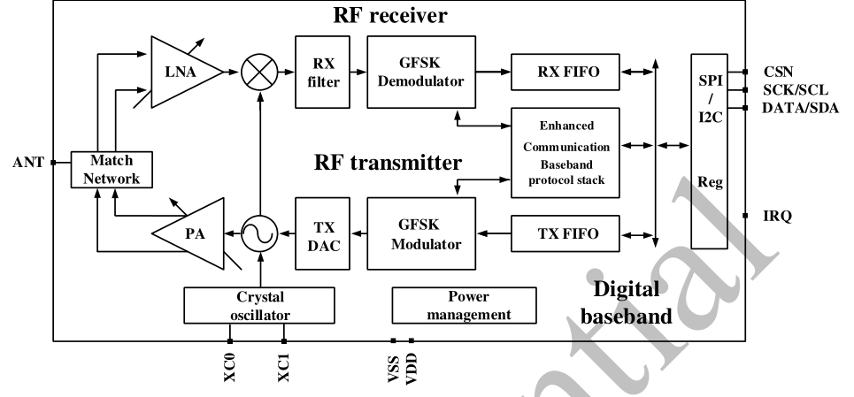

The PAN211x system consists of the following major blocks:

- **RF Receiver:** Low noise amplifier, GFSK demodulator, filter
- **RF Transmitter:** GFSK modulator, power amplifier, DAC
- **Digital Baseband:** Protocol stack, network layer, register bank, enhanced communication engine
- **Crystal Oscillator:** Frequency reference
- **Power Management:** LDO, voltage regulation
- **Interface:** SPI/I2C, FIFO (TX/RX), IRQ
- **Antenna Matching:** External antenna interface

---

## 5. Pin Information

### Pin Diagram

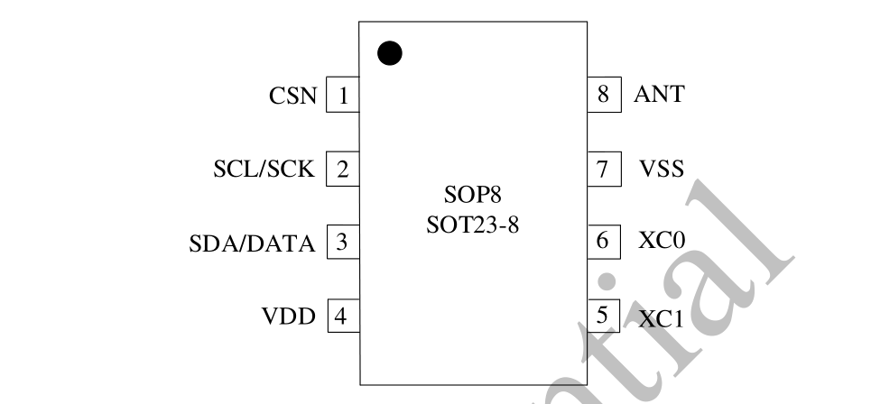

### Pin Description

| Pin | Symbol | Type | Description |
|-----|--------|------|-------------|
| 1 | CSN | I | SPI chip select signal input |
| 2 | SCK/SCL | I | SPI clock signal input / I2C clock signal input |
| 3 | DATA/SDA | I/O | 3-wire SPI data input/output / I2C data input/output |
| 4 | VDD | P | Power supply input |
| 5 | XC1 | AI | Crystal input |
| 6 | XC0 | AO | Crystal output |
| 7 | VSS | G | Ground |
| 8 | ANT | AI | Antenna interface |

**Pin Types:**
- I: Input
- O: Output
- I/O: Bidirectional
- AI: Analog Input
- AO: Analog Output
- P: Power
- G: Ground

---

## 6. Electrical Characteristics

Maximum and minimum values are obtained through comprehensive evaluation, design simulation, and/or process characteristics, and are not tested on the production line. Based on comprehensive evaluation, minimum and maximum values are obtained by sample testing, taking the average value plus or minus three times the standard distribution (average ±3σ).

### 6.1 RF Characteristics

#### General RF Characteristics

| Parameter | Symbol | Description | Conditions | Unit | Min | Typ | Max |
|-----------|--------|-------------|------------|------|-----|-----|-----|
| Operating frequency | f_OP | | | MHz | 2400 | - | 2483 |
| PLL resolution | PLL_res | PLL programming resolution | | Hz | - | 4 | - |
| Bit rate | DR | | | Mbps | 0.25 | 1 | 2 |
| Modulation deviation | Δf_BLE,2M | BLE mode 2Mbps | | kHz | - | 500 | - |
| Modulation deviation | Δf_BLE,1M | BLE mode 1Mbps | | kHz | - | 250 | - |
| Modulation deviation | Δf_BLE,250k | BLE mode 250kbps | | kHz | - | 170 | - |
| Modulation deviation | Δf_297L,2M | XN297L mode 2Mbps | | kHz | - | 500 | - |
| Modulation deviation | Δf_297L,1M | XN297L mode 1Mbps | | kHz | - | 250 | - |
| Modulation deviation | Δf_297L,250k | XN297L mode 250kbps | | kHz | - | 170 | - |
| Channel spacing | f_BLE,CS,2M | BLE mode 2Mbps | | MHz | - | 2 | - |
| Channel spacing | f_BLE,CS,1M | BLE mode 1Mbps | | MHz | - | 1 | - |
| Channel spacing | f_BLE,CS,250k | BLE mode 250kbps | | MHz | - | 1 | - |
| Channel spacing | f_297L,CS,2M | XN297L mode 2Mbps | | MHz | - | 2 | - |
| Channel spacing | f_297L,CS,1M | XN297L mode 1Mbps | | MHz | - | 1 | - |
| Channel spacing | f_297L,CS,250k | XN297L mode 250kbps | | MHz | - | 1 | - |

#### TX Characteristics

| Parameter | Symbol | Description | Conditions | Unit | Min | Typ | Max |
|-----------|--------|-------------|------------|------|-----|-----|-----|
| TX output power | P_RFTX | | | dBm | -42 | - | 9 |
| Power control range | P_RFC | | | dB | - | 51 | - |
| Power step | P_RFCR | | | dB | - | - | ±3 |
| Adjacent channel leakage ratio | P_RF1M,1 | First adjacent @1Mbps | | dBc | - | TBD | - |
| Adjacent channel leakage ratio | P_RF1M,2 | Second adjacent @1Mbps | | dBc | - | TBD | - |
| Adjacent channel leakage ratio | P_RF1M,≥3 | Third adjacent @1Mbps | | dBc | - | TBD | - |
| Adjacent channel leakage ratio | P_RF2M,2 | First adjacent @2Mbps | | dBc | - | TBD | - |
| Adjacent channel leakage ratio | P_RF2M,4 | Second adjacent @2Mbps | | dBc | - | TBD | - |
| Adjacent channel leakage ratio | P_RF2M,≥6M | Third adjacent @2Mbps | | dBc | - | TBD | - |
| 20dB bandwidth | P_BW1M | @1Mbps | | MHz | - | 1.2 | - |
| 20dB bandwidth | P_BW2M | @2Mbps | | MHz | - | 2.2 | - |
| 20dB bandwidth | P_BW250k | @250kbps | | MHz | - | 0.7 | - |
| Spurious power | P_SP,1 | ≤1GHz | | dBm | - | - | -60 |
| Spurious power | P_SP,2 | ≥1GHz | | dBm | - | - | -40 |

#### RX Characteristics

| Parameter | Symbol | Description | Conditions | Unit | Min | Typ | Max |
|-----------|--------|-------------|------------|------|-----|-----|-----|
| Maximum input power | P_RX,MAX | | | dBm | - | - | 10 |
| RX sensitivity | P_SENS,1M,BLE | BLE mode 1Mbps | BER = 0.1% | dBm | - | -95 | - |
| RX sensitivity | P_SENS,2M,BLE | BLE mode 2Mbps | | dBm | - | -88 | - |
| RX sensitivity | P_SENS,250K | 250kbps | | dBm | - | -98 | - |
| RX sensitivity | P_SENS,1MS2,BLE | BLE mode 500kbps | 1Mbps ideal transmitter, ≤37 bytes | dBm | - | -99 | - |
| RX sensitivity | P_SENS,1MS8,BLE | BLE mode 125kbps | | dBm | - | -102 | - |
| RX sensitivity | P_SENS,250KS2 | 125kbps | | dBm | - | -101 | - |
| RX sensitivity | P_SENS,250KS8 | 31.25kbps | | dBm | - | -103 | - |
| RX sensitivity | P_SENS,1M,297L | XN297L mode 1Mbps | | dBm | - | -95 | - |
| RX sensitivity | P_SENS,2M,297L | XN297L mode 2Mbps | | dBm | - | -88 | - |
| RX sensitivity | P_SENS,250K,297L | XN297L mode 250kbps | | dBm | - | -98 | - |
| Co-channel rejection | C/I_CO,1M,BLE | @1Mbps | | dB | - | 10 | - |
| Adjacent channel selectivity | C/I_1M,1M,BLE | 1MHz spacing @1Mbps | | dB | - | -7 | - |
| Adjacent channel selectivity | C/I_2M,1M,BLE | 2MHz spacing @1Mbps | | dB | - | -35 | - |
| Adjacent channel selectivity | C/I_≥3M,1M,BLE | ≥3MHz spacing @1Mbps | | dB | - | -39 | - |
| Image rejection | C/I_Image,1M,BLE | @1Mbps | | dB | - | -18 | - |
| Image ±1MHz selectivity | C/I_Image1M,1M,BLE | @1Mbps | | dB | - | -31 | - |
| Adjacent channel selectivity | C/I_≥6M,1M,BLE | ≥6MHz spacing @1Mbps | | dB | - | -44 | - |
| Co-channel rejection | C/I_CO,2M,BLE | @2Mbps | | dB | - | 9 | - |
| Adjacent channel selectivity | C/I_2M,2M,BLE | 2MHz spacing @2Mbps | | dB | - | -5 | - |
| Adjacent channel selectivity | C/I_4M,2M,BLE | 4MHz spacing @2Mbps | | dB | - | -34 | - |
| Adjacent channel selectivity | C/I_≥6M,2M,BLE | ≥6MHz spacing @2Mbps | | dB | - | -35 | - |
| Image rejection | C/I_Image,2M,BLE | @2Mbps | | dB | - | -20 | - |
| Image ±2MHz selectivity | C/I_Image±2M,2M,BLE | @2Mbps | | dB | - | -31 | - |
| Adjacent channel selectivity | C/I_≥12M,2M,BLE | ≥12MHz spacing @2Mbps | | dB | - | -38 | - |

#### RSSI Characteristics

| Parameter | Symbol | Description | Conditions | Unit | Min | Typ | Max |
|-----------|--------|-------------|------------|------|-----|-----|-----|
| RSSI indication range | RSSI_RFC | | | dBm | -100 | - | -20 |
| RSSI accuracy | RSSI_Auu | | | dB | - | ±2 | - |
| RSSI resolution | RSSI_Res | | | dB | - | 0.25 | - |
| RSSI sampling period | RSSI_Per | | | µs | - | 0.25 | - |

#### RF Timing Characteristics

| Parameter | Symbol | Description | Conditions | Unit | Min | Typ | Max |
|-----------|--------|-------------|------------|------|-----|-----|-----|
| Crystal startup time | T_OSC,EN | 32MHz crystal | | µs | - | 75 | - |
| Crystal startup time | T_OSC,EN | 16MHz crystal | | µs | - | 250 | - |
| TX settling time | T_TX,EN | TX preparation time | | µs | 73 | - | - |
| RX settling time | T_RX,EN | RX preparation time | | µs | 64 | - | - |
| TX disable time | T_TX,DISABLE | TX shutdown time | | µs | 5 | - | - |
| RX disable time | T_RX,DISABLE | RX shutdown time | | µs | 5 | - | - |
| TX to RX switch time | T_TX-RX | | | µs | 67 | - | - |
| RX to TX switch time | T_RX-TX | | | µs | 75 | - | - |

#### RF Power Consumption Characteristics

| Parameter | Symbol | Description | Conditions | Unit | Min | Typ | Max |
|-----------|--------|-------------|------------|------|-----|-----|-----|
| TX current @9dBm | I_TX,P9dBm | | | mA | - | 25 | - |
| TX current @8dBm | I_TX,P8dBm | | | mA | - | 23 | - |
| TX current @7dBm | I_TX,P7dBm | | | mA | - | 21.5 | - |
| TX current @6dBm | I_TX,P6dBm | | | mA | - | 21.4 | - |
| TX current @5dBm | I_TX,P5dBm | | | mA | - | 20 | - |
| TX current @4dBm | I_TX,P4dBm | | | mA | - | 19 | - |
| TX current @3dBm | I_TX,P3dBm | | | mA | - | 19.1 | - |
| TX current @2dBm | I_TX,P2dBm | | | mA | - | 18.5 | - |
| TX current @1dBm | I_TX,P1dBm | | | mA | - | 17.5 | - |
| TX current @0dBm (default) | I_TX,P0dBm | | | mA | - | 17 | - |
| TX current @0dBm (low power) | I_TX,P0dBm | | | mA | - | 10.5 | - |
| TX current @-5dBm | I_TX,P-5dBm | | | mA | - | 9.5 | - |
| TX current @-8dBm | I_TX,P-8dBm | | | mA | - | 8.7 | - |
| TX current @-14dBm | I_TX,P-14dBm | | | mA | - | 7.2 | - |
| TX current @-19dBm | I_TX,P-19dBm | | | mA | - | 6.1 | - |
| TX current @-25dBm | I_TX,P-25dBm | | | mA | - | 5.3 | - |
| TX current @-40dBm | I_TX,P-40dBm | | | mA | - | 4.5 | - |
| RX current @1Mbps | I_RX,1M | | | mA | - | 7 | - |
| RX current @2Mbps | I_RX,2M | | | mA | - | 7.9 | - |
| RX current @250kbps | I_RX,250K | | | mA | - | 7.1 | - |

### 6.2 Reset Characteristics

| Parameter | Symbol | Description | Conditions | Unit | Min | Typ | Max |
|-----------|--------|-------------|------------|------|-----|-----|-----|
| Negative threshold voltage | V_ILR | nRESET | VDD=1.8V-3.3V, T_A=25°C | V | - | - | 0.22×VDD |
| Positive threshold voltage | V_IHR | nRESET | VDD=1.8V-3.3V, T_A=25°C | V | 0.48×VDD | - | - |
| Schmitt trigger hysteresis | V_hys_rst | | VDD=1.8V-3.3V, T_A=25°C | V | - | - | 0.26×VDD |
| Internal pull-up resistor | R_RST | nRESET pin | VDD=3.3V, T_A=25°C | kΩ | - | 51 | - |
| Input filter pulse time | t_FR,0.3pF | nRESET pin | VDD=3.3V, T_A=25°C | ns | - | TBD | - |

### 6.3 Clock Characteristics

#### 32MHz HXTAL Characteristics

| Parameter | Symbol | Description | Conditions | Unit | Min | Typ | Max |
|-----------|--------|-------------|------------|------|-----|-----|-----|
| Crystal frequency | f_HXTL | High speed crystal | VDD=3.3V, T_A=25°C | MHz | - | 32 | - |
| Load capacitance | C_LoadHXTL | | VDD=3.3V, T_A=25°C | pF | 7 | 10 | 12 |
| Oscillator current | I_DDHXTL | HXTAL oscillator | VDD=3.3V, T_A=25°C | µA | - | 250 | - |
| Startup time | t_SUHXTL | HXTAL oscillator | VDD=3.3V, T_A=25°C, ESR=40Ω, C_HXTL=10pF | µs | - | 300 | - |
| Fast startup time | t_SUHXTL Quick | HXTAL oscillator | VDD=3.3V, T_A=25°C, ESR=40Ω, C_HXTL=10pF | µs | - | 75 | - |
| ESR requirement | ESR_HXTL | Crystal ESR | | Ω | - | 40 | 100 |
| Frequency tolerance | F_TOLHXTL | Crystal frequency | VDD=3.3V, T_A=25°C | ppm | -20 | - | 20 |
| Drive power | PD_HXTL | Crystal drive power | VDD=3.3V, T_A=25°C | µW | - | - | 100 |

#### 16MHz HXTAL Characteristics

| Parameter | Symbol | Description | Conditions | Unit | Min | Typ | Max |
|-----------|--------|-------------|------------|------|-----|-----|-----|
| Crystal frequency | f_HXTL | High speed crystal | VDD=3.3V, T_A=25°C | MHz | - | 16 | - |
| Load capacitance | C_LoadHXTL | | VDD=3.3V, T_A=25°C | pF | 7 | 10 | 12 |
| Oscillator current | I_DDHXTL | HXTAL oscillator | VDD=3.3V, T_A=25°C | µA | - | 210 | - |
| Startup time | t_SUHXTL | HXTAL oscillator | VDD=3.3V, T_A=25°C, ESR=40Ω, C_HXTL=10pF | µs | - | 600 | - |
| Fast startup time | t_SUHXTL Quick | HXTAL oscillator | VDD=3.3V, T_A=25°C, ESR=40Ω, C_HXTL=10pF | µs | - | 250 | - |
| ESR requirement | ESR_HXTL | Crystal ESR | | Ω | - | 40 | 100 |
| Frequency tolerance | F_TOLHXTL | Crystal frequency | VDD=3.3V, T_A=25°C | ppm | -20 | - | 20 |
| Drive power | PD_HXTL | Crystal drive power | VDD=3.3V, T_A=25°C | µW | - | - | 100 |

### 6.4 General Operating Conditions

| Parameter | Symbol | Description | Conditions | Unit | Min | Typ | Max |
|-----------|--------|-------------|------------|------|-----|-----|-----|
| Operating voltage | VDD | | T_A=25°C | V | 1.8 | - | 3.6 |
| Storage temperature | T_ST | | | °C | -65 | - | 150 |
| Operating temperature | T_A | | | °C | -40 | - | 85 |
| Junction temperature | T_J-SOP8 | | | °C | -40 | - | 125 |
| Thermal resistance | R_θJA-SOP8 | | | °C/W | - | 41 | - |

### 6.5 Electrical Sensitivity

| Parameter | Symbol | Description | Conditions | Unit | Min | Typ | Max |
|-----------|--------|-------------|------------|------|-----|-----|-----|
| ESD @ HBM [1] | V_ESDHBM | Human Body Model | T_A=25°C | kV | - | ±4 | - |
| ESD @ CDM [2] | V_ESDCDM | Charge Device Model | T_A=25°C | V | - | ±1000 | - |
| ESD @ MM [3] | V_ESDMM | Machine Model | T_A=25°C | V | - | ±200 | - |
| Latch-up current [4] | I_latchup | | T_A=25°C | mA | - | ±500 | - |

**Notes:**
1. Determined according to ANSI/ESDA/JEDEC JS-001 standard, ESD sensitivity test - Human Body Model (HBM) - device level.
2. Determined according to ANSI/ESDA/JEDEC JS-002 ESD sensitivity test standard.
3. Determined according to JESD22-A115-C ESD sensitivity test standard.
4. Measured according to JEDEC EIA/JESD78 standard.

### 6.6 Absolute Maximum Ratings

| Parameter | Symbol | Description | Conditions | Unit | Min | Typ | Max |
|-----------|--------|-------------|------------|------|-----|-----|-----|
| Supply voltage | VDD - VSS | External main supply | T_A=25°C | V | -0.3 | - | 3.6 |
| Input voltage | V_IN | On other pins | T_A=25°C | V | VSS-0.3 | - | VDD+0.3 |
| Power dissipation | P_VDD | Maximum power | VDD=3.3V, T_A=25°C | mW | - | 120 | - |

### 6.7 Current Characteristics

| Symbol | Parameter | Conditions | Typ (µA) |
|--------|-----------|------------|----------|
| Deepsleep | Deep sleep mode current | VDD=3.3V, T_A=25°C | 0.3 |
| Sleep | Sleep mode current | VDD=3.3V, T_A=25°C | 0.8 |
| STB1 | Standby 1 mode current | VDD=3.3V, T_A=25°C | 160 |
| STB2 | Standby 2 mode current | VDD=3.3V, T_A=25°C | 590 |
| STB3 | Standby 3 mode current | VDD=3.3V, T_A=25°C | 850 |

---

## 7. Operating Modes

The PAN211x has 7 operating modes: Deepsleep mode, Sleep mode, STB1 mode, STB2 mode, STB3 mode, TX mode, and RX mode. All operating states can be switched through the STATE_CFG register.

### 7.1 State Transition Diagram

The PAN211x operating state machine showing all power modes and transitions:

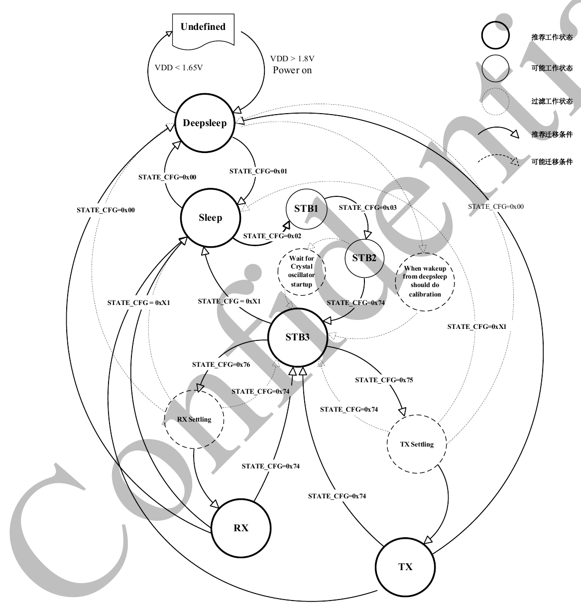

**Current Consumption by State:**
- **Deepsleep:** 300nA (lowest power, only page0 0x00-0x06 registers active)
- **Sleep:** 800nA (all registers retained, crystal off)
- **STB1:** 160µA (LDO active, core logic enabled)
- **STB2:** 590µA (crystal on, not output)
- **STB3:** 850µA (crystal output, ready for TX/RX)
- **RX:** 7mA (receiving, 64µs settling time)
- **TX:** 10.5-24mA (transmitting, 73µs settling time, power-dependent)

**Legend:**
- **Recommended working states:** Solid borders (Deepsleep, Sleep, STB3, TX, RX)
- **Intermediate states:** Transitional (STB1, STB2, TX/RX Settling)
- **Recommended transition conditions:** Thick lines
- **Alternative transition conditions:** Thin/dashed lines

**Note:** During power-up, if STB2 needs to be skipped, the register configurations (POR_RSTL, EN_LS_3V, ISO_TO_0, etc.) in the STB2 to STB3 transition process cannot be skipped.

### 7.2 Deepsleep Mode

After configuring the STATE_CFG register to 0x00, the PAN211x enters Deepsleep mode.

**Characteristics:**
- Lowest operating current
- SPI or I2C interface remains active
- Only page0 registers 0x00~0x06 can be read/written; other register operations are invalid
- Only page0 registers 0x00~0x06 retain data; other register data is not retained

### 7.3 Sleep Mode

**Entry conditions:**
- From Deepsleep mode: Configure STATE_CFG register to 0x01
- From Standby mode (SPI): Configure STATE_CFG register to 0x21
- From Standby mode (I2C): Configure STATE_CFG register to 0x71

**Characteristics:**
- All transceiver function modules are turned off
- Crystal oscillator stops oscillating
- Chip stops working
- Low current consumption
- All internal register values and FIFO values remain unchanged
- SPI/I2C interface can read/write page0 registers 0x00~0x06
- Reading/writing registers other than page0 0x00~0x06 is prohibited

### 7.4 Standby Mode

Standby mode is divided into three sub-states: STB1, STB2, and STB3.

#### STB1 Mode
- Internal LDO starts working
- Core voltage area logic is enabled

#### STB2 Mode
- OSC crystal is turned on, but not output to other modules

#### STB3 Mode
- OSC crystal clock is output to each module
- From this state, can switch to transmit or receive state

### 7.5 TX Mode

When data needs to be sent, switch to TX mode.

**Prerequisites:**
- TX FIFO must contain data

**Operation:**
- Configure STATE_CFG register to 0x75 to start switching to transmit mode
- Chip does not switch directly from STB3 mode to TX mode; requires a transmit preparation time
- After single packet transmission is complete:
  - **Single packet transmit mode:** Chip returns to STB3 mode
  - **Continuous transmit mode:** PAN211x continues to remain in transmit state until user configures STATE_CFG register to 0x74, then exits transmit state and returns to STB3 mode

### 7.6 RX Mode

When data needs to be received, switch to RX mode.

**Operation:**
- When PAN211x is in STB3 state, configure STATE_CFG register to 0x76 to enter RX mode
- When the address of the received data packet matches the chip's address (set through PIPE0_RXADDRx_CFG register) and the CRC check is correct, data is automatically stored in RX FIFO and a data reception interrupt is generated

**RSSI Measurement:**
- In RX mode, received signal power can be obtained through PKT_RSSI_L and PKT_RSSI_H registers
- Airborne noise RSSI strength can be obtained through RT_RSSI_L and RT_RSSI_H registers

### 7.7 Operating State Switching Timing

#### Power-On Initialization Timing

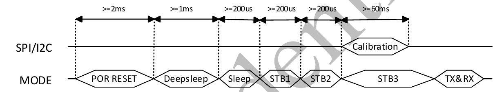

The PAN211x has two modes: Normal type and Enhanced type.
- **Normal type:** Does not support ACK or ACK+data packet response; unidirectional communication
- **Enhanced type:** Bidirectional communication with automatic acknowledgment

#### 7.7.1 Normal Type

**Single Packet Transmission Timing**

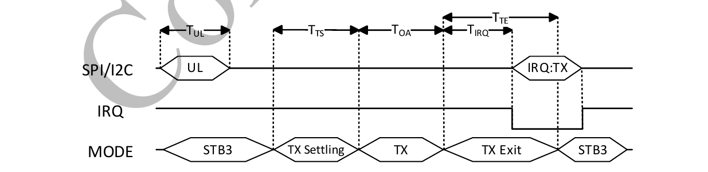

| Symbol | Description | Remark |
|--------|-------------|--------|
| T_UL | Upload Time | Time to write data to FIFO via SPI/I2C bus: payload_length(byte) / (SPI or I2C data rate(bit/s)) |
| T_TS | TX Settling Time | Time to enable TX circuit | 73µs |
| T_OA | Time On Air | TX transmission time for airborne data | See calculation formula* |
| T_IRQ | IRQ Time | Time from completing TX airborne data transmission to generating TX interrupt | 23µs |
| T_TE | TX Exit Time | Time from completing TX airborne data transmission to fully exiting TX state | 26µs |

**Single Packet Reception Timing**

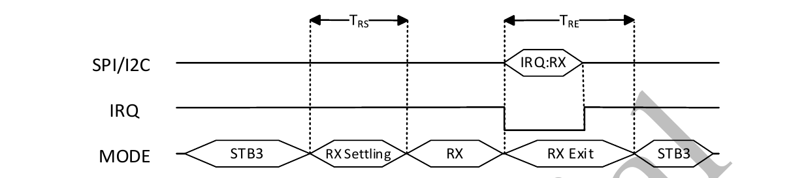

| Symbol | Description | Remark |
|--------|-------------|--------|
| T_RS | RX Settling Time | Time to enable RX circuit | 64µs |
| T_RE | RX Exit Time | Time to disable RX circuit | 5µs |

#### 7.7.2 Enhanced Type

**Enhanced Mode Single Packet Transmission Timing**

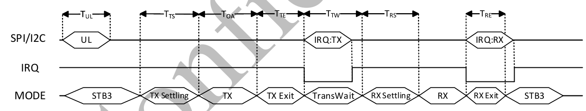

| Symbol | Description | Remark |
|--------|-------------|--------|
| T_UL | Upload Time | Time to write data to FIFO via SPI/I2C bus | payload_length(byte) / (SPI or I2C data rate(bit/s)) |
| T_TS | TX Settling Time | Time to enable TX circuit | 73µs |
| T_OA | Time On Air | TX transmission time for airborne data | See calculation formula* |
| T_TE | TX Exit Time | Time from completing TX airborne data transmission to exiting TX state and generating TX interrupt | 23µs |
| T_TW | Trans Wait Time | TRX conversion delay time | TRX_TRANS_WAIT_TIME register × 1µs |
| T_RS | RX Settling Time | Time to enable RX circuit | 62µs |
| T_RE | RX Exit Time | Time to disable RX circuit | 5µs |

**Enhanced Mode Single Packet Reception Timing**

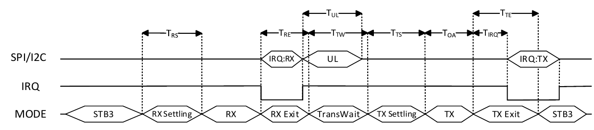

| Symbol | Description | Remark |
|--------|-------------|--------|
| T_RS | RX Settling Time | Time to enable RX circuit | 64µs |
| T_RE | RX Exit Time | Time to disable RX circuit | 2µs |
| T_TW | RX Trans Wait Time | TRX conversion delay time | TRX_TRANS_WAIT_TIME register × 1µs |
| T_TS | TX Settling Time | Time to enable TX circuit | 73µs |
| T_UL | Upload Time | Time to write data to FIFO via SPI/I2C bus | payload_length(byte) / (SPI or I2C data rate(bit/s)) |
| T_OA | Time On Air | TX transmission time for airborne data | See calculation formula |
| T_IRQ | IRQ Time | Time from completing TX airborne data transmission to generating TX interrupt | 23µs |
| T_TE | TX Exit Time | Time from completing TX airborne data transmission to fully exiting TX state | 26µs |

**Time On Air Calculation Formulas:**

1. **General Frame Structure:**

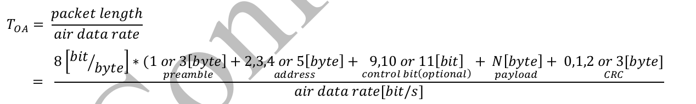
```
T_OA = packet_length / air_data_rate

packet_length [bit] = 8 × (preamble[1 or 3 byte] + address[2,3,4 or 5 byte] +
                     control_bit[9,10 or 11 bit] + payload[N byte] + CRC[0,1,2 or 3 byte])
```

2. **Bluetooth LE S2/S8 Spread Spectrum Mode:**

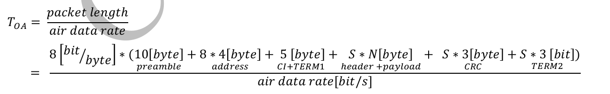
```
T_OA = packet_length / air_data_rate

packet_length [bit] = 8 × (preamble[10 byte] + address[8×4 byte] + CI+TERM1[5 byte] +
                     header[S×N byte] + payload[S×N byte] + CRC[S×3 byte] + TERM2[S×3 bit])
```

Where:
- S = 2 for S2 mode, S = 8 for S8 mode
- N = TX_PAYLOAD_LENGTH

**Important Timing Notes:**

3. If the enhanced receiver needs to write FIFO after receiving data, then T_RE + T_TW + T_TS should be greater than T_UL, otherwise there is not enough time to write FIFO.

4. To ensure timely receipt of ACK data packets, the enhanced transmitter's T_IRQ + T_TW + T_RS should be less than the enhanced receiver's T_RE + T_TW + T_TS.

---

## 8. RF Control

### 8.1 Air Data Rate

The air data rate is the modulation signaling rate used by the PAN211x when transmitting and receiving data.

**Supported data rates:**
- 2Mbps (32MHz crystal only)
- 1Mbps
- 500kbps
- 250kbps
- 125kbps
- 31.25kbps

**Characteristics:**
- Lower air data rates provide better receiver sensitivity than higher air data rates
- Higher air data rates can reduce average current and decrease the probability of airborne collisions

**Configuration:**
- Air data rate is set by bits [4:5] of the RF_DATARATE_CFG register
- Transmitter and receiver must be configured with the same air data rate to communicate with each other

### 8.2 Communication Frequency

The communication channel frequency determines the center frequency of the channel used by the chip.

**Channel bandwidth:**
- At 250kbps and 1Mbps rates: Channel bandwidth < 1MHz
- At 2Mbps rate: Channel bandwidth < 2MHz

**Frequency range:**
- PAN211x can operate in the frequency range from 2400MHz to 2483MHz
- Communication frequency setting resolution: 1MHz

**Channel spacing requirements:**
- To ensure non-overlapping channels in 2Mbps mode, channel bandwidth must be ≥ 2MHz
- 1Mbps and 250kbps channel bandwidth is equal to or lower than the RF frequency resolution

**Frequency configuration:**
- Communication frequency is set by the RF_CH register according to the following formula:

```
F0 = 2400 + RF_CH [MHz]
```

where RF_CH register is located at [P0][0x39]

- Users must program the transmitter and receiver with the same communication frequency for them to communicate with each other

### 8.3 TX Power Configuration

In TX mode, transmit power configuration can achieve a range of -42 ~ 9dBm.

**Power levels are controlled through register configuration with steps of approximately ±3dB.**

### 8.4 Signal Strength Indication (RSSI)

RSSI is used to measure the received signal power at the PAN211x chip antenna input port.

**RSSI Calculation:**

```
RSSI (dBm) = (PKT_RSSI - 16384) / 4

where:
PKT_RSSI = PKT_RSSI_L + PKT_RSSI_H[5:0] × 256
```

**RSSI Registers:**
- PKT_RSSI_L: Low 8 bits of signal strength
- PKT_RSSI_H: High 6 bits of signal strength

**Characteristics:**
- Range: -100dBm to -20dBm
- Accuracy: ±2dB
- Resolution: 0.25dB
- Sampling period: 0.25µs

### 8.5 Link Quality Indication (LQI)

LQI (Link Quality Indicator) is used to evaluate the signal quality of the wireless communication link.

**Characteristics:**
- Represented by a 7-bit value
- Range: 0 ~ 127
- Lower LQI value indicates better signal link quality
- Can be implemented through related register configuration

---

*[Continue in next part due to length...]*

---

## 9. Transmission Control Protocol

The PAN211x supports both fixed-length and variable-length communication frame formats. Based on these two communication frame formats, the PAN211x is compatible with multiple RF chip communication frame formats, including XN297L, PAN1026, Bluetooth LE broadcast frame structure, and other 2.4G transceiver chip frame structures.

The built-in digital baseband processor has automatic data packet assembly, timing, automatic acknowledgment, and data packet retransmission functions. Without external microcontroller intervention, it can automatically handle ACK and NO_ACK data packets, supporting variable-length communication from 1 to 64 bytes, and fixed-length communication protocols from 1 to 128 bytes.

Additionally, the PAN211x integrates 6 communication pipes, directly supporting 1:6 star network topology.

### 9.1 Packet Format

The PAN211x supports the following frame structures:
- XN297L Normal Type frame structure
- XN297L Enhanced Type frame structure
- Bluetooth LE 4.0 and above broadcast packet frame structure

#### 9.1.1 XN297L Protocol Frame Structure

**9.1.1.1 Normal Type Frame Structure**

Configuration: WORK_MODE register = 0b00 AND ENHANCE register = 0

| Preamble | Addr | PDU | CRC |
|----------|------|-----|-----|
| 3 bytes | 2-5 bytes | 0-128 bytes | 0-3 bytes |


**9.1.1.2 Enhanced Type Frame Structure**

Configuration: WORK_MODE register = 0b00 AND ENHANCE register = 1

When TX_NOACK register = 0 AND ARC ≠ 0:
- NO_ACK = 0: PAYLOAD is 0~64 bytes
- NO_ACK = 1: PAYLOAD is 0~128 bytes

| Preamble | Addr | Length | PID | NO_ACK  |    PDU     | CRC  |
|----------|------|--------|-----|---------|------------|------|
| 3 bytes  | 2-5 bytes | 7 bit  |2bit |  1 bit | 0-64/128 bytes  | 0-3 bytes  |

#### 9.1.2 Bluetooth LE Broadcast Frame Structure (Bluetooth LE Beacon)

The PAN211x supports BLE 4.0 and above version broadcast and scan, but does not support connection mode. Mobile APP can interact with PAN211x through Bluetooth LE broadcast and scan channels, thereby achieving control of devices using PAN211x.

| Preamble | Addr | Header | Length |    PDU     | CRC  |
|----------|------|--------|--------|------------|------|
| 1 byte   |4bytes| 1 byte | 1 byte | 37 bytes   |3bytes|


When PAN211x transmits broadcast packets, users can customize PDU protocol data unit data. When PAN211x scans, it can receive all Bluetooth LE broadcast data packets that meet protocol requirements.

#### 9.1.3 Bluetooth LE 5.4 S2/S8 Extended Broadcast Protocol Frame Structure

Configuration: BLE (Bluetooth LE) mode, PRI_CI_MODE register = 0 or 1, AND PRI_TX_FEC = 1 (TX end) OR PRI_RX_FEC = 1 (RX end)

**Notes:**
- PDU includes Header and Payload
- N = TX_PAYLOAD_LENGTH
- S2 mode: S=2, S8 mode: S=8
- X = Header length

| Preamble | Addr | CI  | TERM1 |    PDU    |  CRC   |  TERM2  |
|----------|------|-----|-------|-----------|--------|---------|
| 10 bytes | 4-byte spread spectrum becomes 32 bytes  |2 bytes|3 bytes|(N+X)*S bytes| 3S bytes  |3S/8 bytes|

**CRC_SKIP_ADDR Configuration:**
- Default = 0: CRC scope includes Addr, PDU and Header
- = 1: CRC scope only includes PDU and Header

**WHITEN_SKIP_ADDR Configuration:**
- Must be = 1 when connecting with mobile APP: WHITEN (whitening) scope only includes Header and Payload, conforming to Bluetooth standard protocol
- = 0: Includes ADDR, Header and Payload

### 9.2 Protocol Flow

#### 9.2.1 Transmission Flow

Transmission flow includes 2 modes: Normal mode and Enhanced mode.

**Normal Mode Configuration:**
- ENHANCE register = 0
- Select single packet or continuous transmission through REG_TX_CFG_MODE register

**Enhanced Mode Configuration:**
Device enters enhanced mode and automatically switches to RX mode to receive ACK after sending a packet:
1. ENHANCE register = 1
2. TX_NOACK register = 0
3. ARC register ≠ 0

**9.2.1.1 Normal Mode Single Packet Transmission Flow**

Configuration: ENHANCE = 0, REG_TX_CFG_MODE = 0

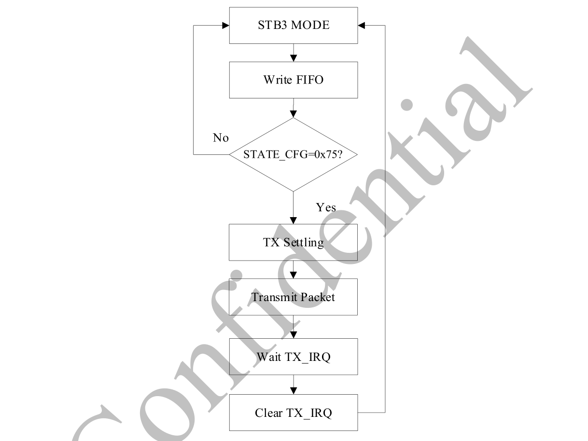

**9.2.1.2 Normal Mode Continuous Transmission Flow**

Configuration: ENHANCE = 0, REG_TX_CFG_MODE = 1

The continuous transmission mode flow allows multiple packets to be transmitted sequentially. After each packet transmission completes, the system checks if STATE_CFG is still 0x75 to continue, or writes new FIFO data and sets TX_FIFO_READY to trigger the next transmission.

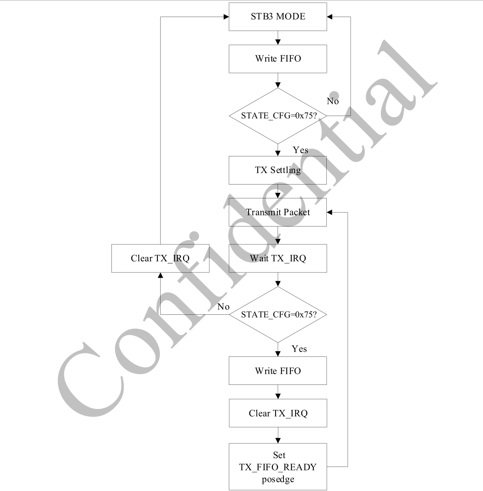

**9.2.1.3 Enhanced Mode Single Packet Transmission Flow**

Configuration: ENHANCE = 1, REG_TX_CFG_MODE = 0

The enhanced mode includes automatic retransmission logic:

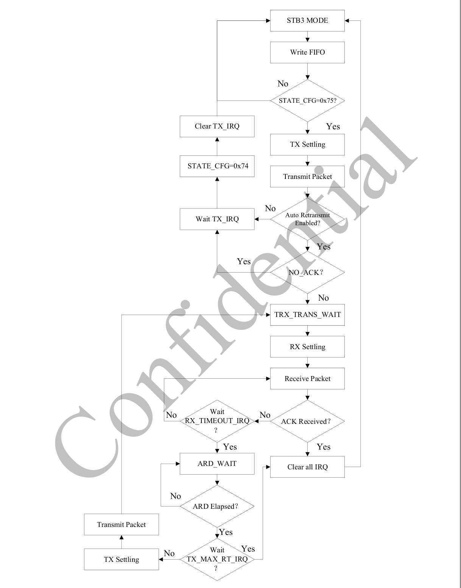

#### 9.2.2 Reception Flow

**9.2.2.1 Normal Mode Single Packet Reception Flow**

Configuration: ENHANCE = 0, REG_RX_CFG_MODE = 0

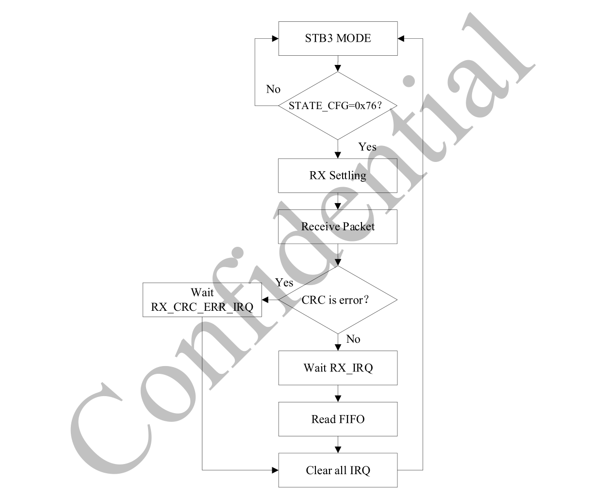

**9.2.2.2 Normal Mode Continuous Reception Flow**

Configuration: ENHANCE = 0, REG_RX_CFG_MODE = 2

Similar to single packet reception, but after receiving and clearing IRQ, the system automatically begins the next data reception. To exit continuous reception mode, configure STATE_CFG register to 0x74.

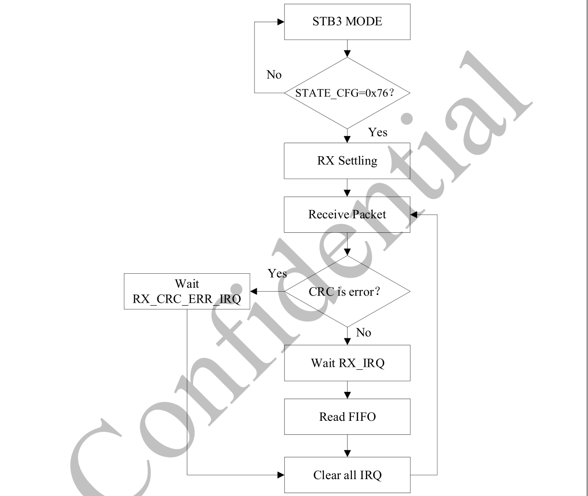

**9.2.2.3 Normal Mode with Timeout Single Packet Reception Flow**

Configuration: ENHANCE = 0, REG_RX_CFG_MODE = 1

Adds timeout detection to single packet reception mode.

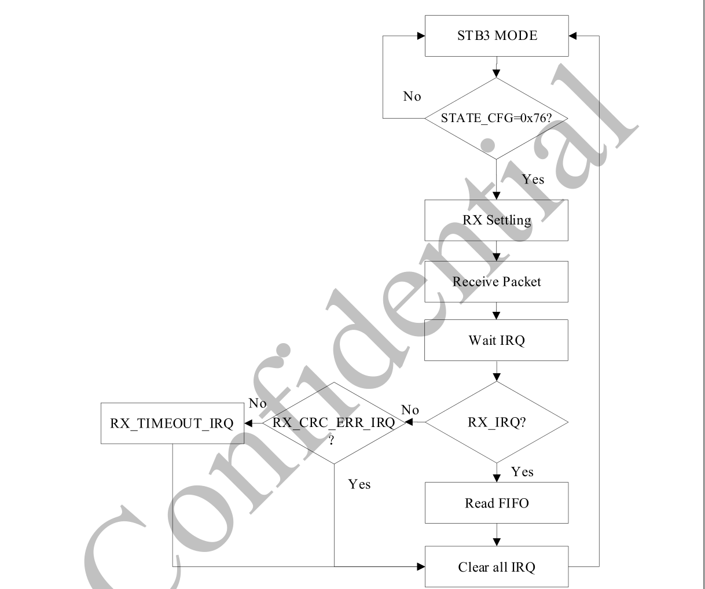

**9.2.2.4 Enhanced Mode Reception Flow**

Configuration: ENHANCE = 1, REG_RX_CFG_MODE = 0 or 1

In enhanced reception mode, DPY_EN register should normally be enabled to allow hardware to autonomously determine received packet length. If DPY_EN register is not enabled, data is received according to the length configured in RX_PAYLOAD_LENGTH register.

The enhanced reception flow includes automatic ACK transmission logic with optional payload.

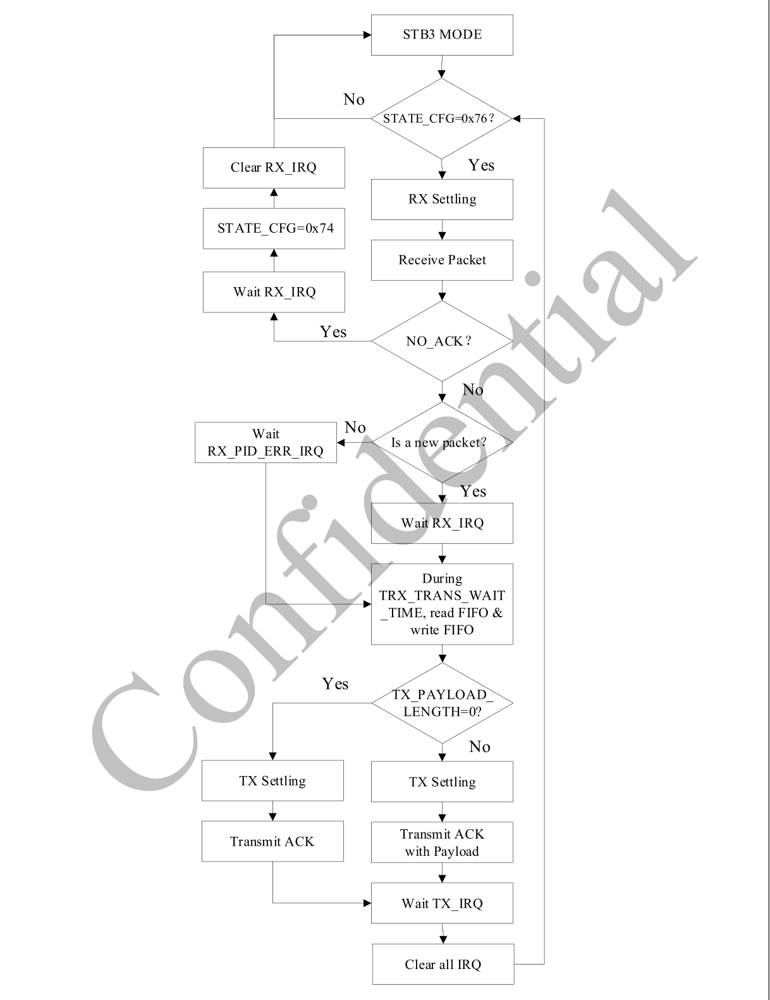


### 9.3 Automatic Transmission Handling

#### 9.3.1 Automatic Retransmission

The PAN211x automatic retransmission function (Auto Retransmit) is an important part of its reliable data transmission mechanism. When the transmitter PAN211x transmits a data packet, if it does not receive an acknowledgment packet (ACK) from the receiver within the specified time, the transmitter can automatically resend the data packet.

**Key Features:**

**Automatic Retransmission Count:**
- Set through ARC (Automatic Retransmission Count) register to specify maximum retransmission count
- When maximum retransmission count is reached without receiving ACK, device triggers MAX_RT interrupt to notify main control unit of transmission failure

**Automatic Retransmission Delay:**
- Set through ARD (Automatic Retransmission Delay) register to specify delay time between retransmissions
- This delay setting can avoid multiple consecutive transmission failures due to instantaneous interference

**Retransmission Management:**
- During each retransmission process, transmitter PAN211x monitors ACK packet reception
- If ACK packet is successfully received, retransmission process stops immediately, indicating data has successfully reached the receiver

#### 9.3.2 Automatic Acknowledgment

The PAN211x automatic acknowledgment function (Auto Acknowledgement) is an important mechanism to ensure reliable data transmission. This function allows the receiver to automatically return an acknowledgment packet (ACK) to the sender after successfully receiving a data packet, confirming correct reception of the data packet. This process is fully automated without main control unit intervention.

**Key Features:**

**Automatic ACK Packet Generation:**
- When receiver successfully receives a data packet, receiver PAN211x automatically generates and sends an ACK packet to sender
- This process requires no additional processing from main control unit, accelerating communication response speed

**Optional ACK with Data:**
- In some cases, ACK packet is not just a simple acknowledgment message, but can also carry data
- This means the receiver can return some data to the sender while sending ACK, achieving bidirectional communication

**Seamless Integration:**
- Automatic acknowledgment function is tightly integrated with automatic retransmission function
- When sender does not receive ACK packet, it automatically triggers retransmission function, further improving data transmission reliability

**Flexible Configuration:**
- Automatic acknowledgment function can be enabled or disabled as needed
- Users can select appropriate configuration mode according to application requirements
- For example, for scenarios with high real-time requirements, this function can be enabled to reduce communication delay

**Reduced Communication Overhead:**
- Since ACK packet is automatically generated and sent by hardware, main control unit can focus on processing core application logic without handling low-level details of communication protocol, thereby reducing system communication overhead

**Improved Reliability:**
- By automatically acknowledging every received data packet, ensuring data transmission reliability and reducing risk of data loss

**Simplified Design:**
- No need to manually manage data packet acknowledgment and retransmission, simplifying communication protocol design and implementation

**Adaptation to Complex Environments:**
- In environments with interference or unstable signals, automatic acknowledgment function can effectively address communication challenges, ensuring reliable data transmission

#### 9.3.3 Automatic Retransmission Timing Diagrams

**9.3.3.1 Enhanced Type Normal Transmission and Reception Timing**

In the timing diagram, PTX's 67µs includes closing TX circuit + opening RX circuit. PRX's 75µs includes closing RX circuit + opening TX circuit.

The TRX_TRANS_WAIT_TIME register can change TRX conversion time. When the receiver returns ACK with many bytes or MCU processing speed is slow, the TRX_TRANS_WAIT_TIME register can be configured to reserve more processing time for the MCU.

Normal TRX conversion time is modified by configuring the TRX_TRANS_WAIT_TIME register.

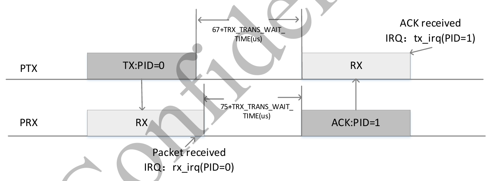

**9.3.3.2 Enhanced Type Receiver Lost Packet Timing**

This describes the timing when PRX end loses the first packet. The 255µs is the ARD default configuration wait time. The 2ms is the wait time configured using the REG_RX_TIMEOUT register default value. PTX transmit-to-receive time 67µs includes closing TX circuit + opening RX circuit + TRX conversion (default configured as 0, using TRX_TRANS_WAIT_TIME register configuration).

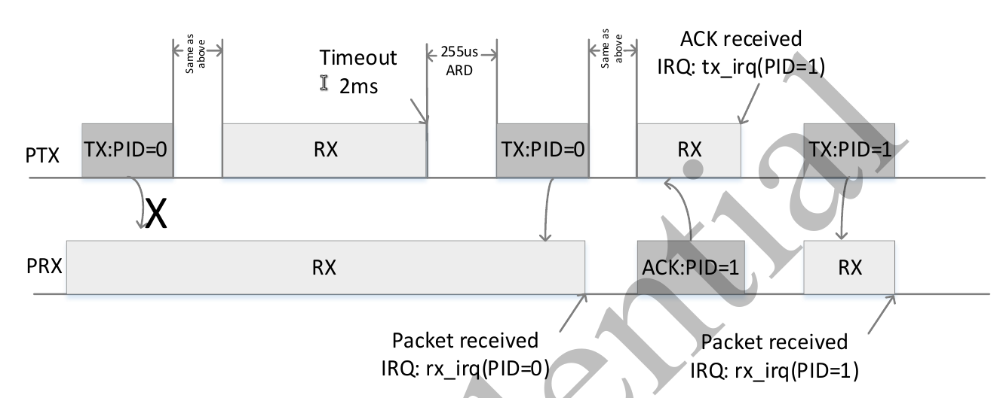

**9.3.3.3 Enhanced Type Transmitter Lost ACK Timing**

This describes the timing when TX end loses the first ACK. The 255µs is the ARD default configuration wait time. The 2ms is the wait time configured using the REG_RX_TIMEOUT register default value. PTX transmit-to-receive 67µs includes closing TX circuit + opening RX circuit + TRX conversion (default configured as 0, using TRX_TRANS_WAIT_TIME register configuration).

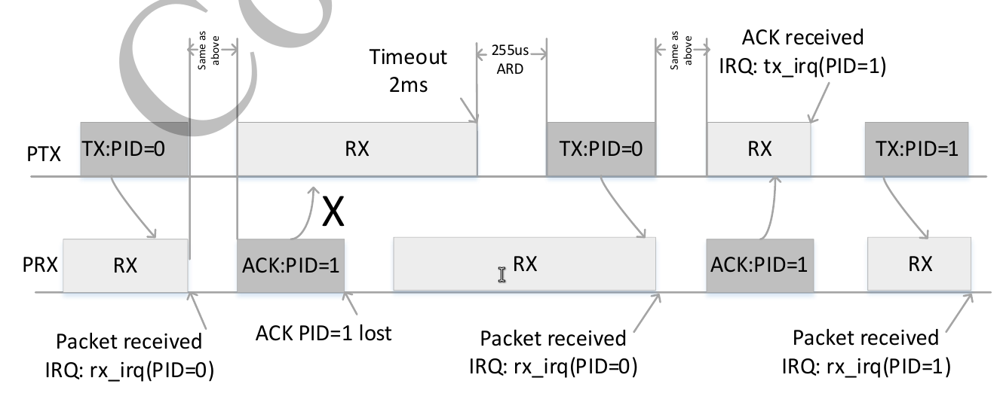

#### 9.3.4 Data Packet PID Identification

Enhanced data packets all include a two-bit PID (data packet identifier) to help the receiver identify whether the data is a new data packet or a retransmitted data packet, preventing multiple storage of the same data packet.

**PID Generation and Detection:**

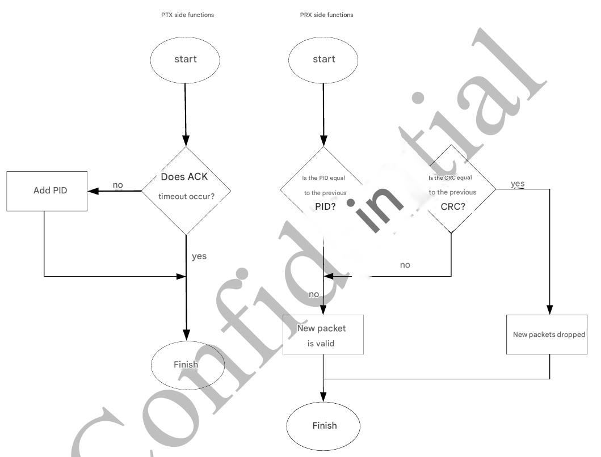

After the transmitter retrieves a new packet from FIFO, PID value increments by one. When automatic retransmission occurs, TX_PID sent by TX end does not increase, and TX_PID in ACK returned by RX end also does not increase.

### 9.4 Multi-Channel Reception

Multi-channel reception is a function used in RX mode, containing 6 parallel data pipes with unique addresses. A data pipe is a logical channel within a physical RF channel. Each data pipe in PAN211x has an independent physical address (data pipe address).

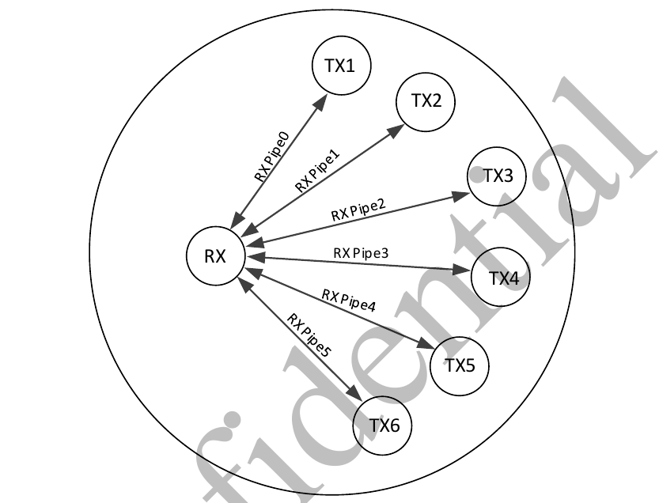

When PAN211x is configured in RX mode, it can receive data from 6 different data pipes on one communication frequency. Each data pipe has its unique address and can be independently configured. Up to 6 PAN211x configured in TX mode can communicate with one PAN211x configured in RX mode.

All data pipe addresses are searched simultaneously, but only one data pipe can receive data packets at a time. All data pipes support both Normal and Enhanced modes.

**Settings Common to All Data Pipes:**
- Normal mode
- Enhanced mode
- Communication frequency
- Data rate
- CRC enable/disable
- RX address width

**Multi-Channel Reception Address Table:**

| Actual Address | addr4 | addr3 | addr2 | addr1 | addr0 |
|----------------|-------|-------|-------|-------|-------|
| Pipe 0 | pipe0_addr4 | pipe0_addr3 | pipe0_addr2 | pipe0_addr1 | pipe0_addr0 |
| Pipe 1 | pipe1_addr4 | pipe1_addr3 | pipe1_addr2 | pipe1_addr1 | pipe1_addr0 |
| Pipe 2 | pipe1_addr4 | pipe1_addr3 | pipe1_addr2 | pipe1_addr1 | pipe2_addr0 |
| Pipe 3 | pipe1_addr4 | pipe1_addr3 | pipe1_addr2 | pipe1_addr1 | pipe3_addr0 |
| Pipe 4 | pipe1_addr4 | pipe1_addr3 | pipe1_addr2 | pipe1_addr1 | pipe4_addr0 |
| Pipe 5 | pipe1_addr4 | pipe1_addr3 | pipe1_addr2 | pipe1_addr1 | pipe5_addr0 |

**Note:** Pipe 0 address can be configured for all 5 bytes. Pipes 1-5 share the high 4 bytes, only the lowest byte address can be configured.

**Usage:**
- Multi-channel reception function is enabled by setting RXPIPE_CFG register
- When receiver receives a packet, first read RX_SYNC_ADDR register to get the pipe number that received the data packet
- If you need to reply to the sender, write the read pipe number to ACK_PIPE
- When replying with ACK, the transmit address will automatically switch to the received pipe number address

### 9.5 Filtering Functions

Length filtering and whitelist filtering are common and important filtering mechanisms in Bluetooth communication. Length filtering improves device processing efficiency by controlling data packet length, while whitelist filtering enhances communication security by limiting communication objects. These two filtering functions used together can ensure Bluetooth devices communicate in a secure, reliable, and efficient environment.

#### 9.5.1 Whitelist Filtering

Whitelist filtering is a security filtering mechanism that maintains a device address list (i.e., whitelist), only allowing data packets from devices that meet whitelist rules to pass, thereby enhancing communication security and reliability.

**Bluetooth LE Broadcast Frame Structure:**

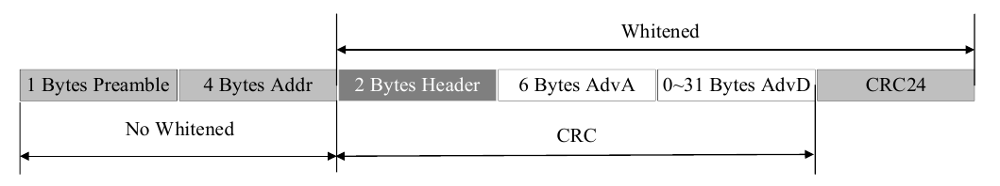

The 6 bytes of AdvA in the frame can be set as a whitelist for filtering. Matching 0~6 bytes can be selected through the WL_MATCH_MODE register.

**Register Configurations:**

**PLD_START_BYTE Register:**
- Configures the starting byte for whitelist filtering
- Starting position is from the AdvA field
- Used together with WL_MATCH_MODE and WL_ADVA registers
- When whitelist starting byte is 0, corresponds to the 1st byte of AdvA

**WL_MATCH_MODE Register:**
- Configures whitelist filtering mode
- Configuration options:
  - 000: No filtering, report all
  - 001: Only match WL_ADVA[47:40] to report
  - 010: Only match WL_ADVA[47:32] to report
  - 011: Only match WL_ADVA[47:24] to report
  - 100: Only match WL_ADVA[47:16] to report
  - 101: Only match WL_ADVA[47:8] to report
  - 110: Need WL_ADVA[47:0] full match to report
  - 111: Same as 000, no filtering report all

**Whitelist registers use P0 0x34~0x2F registers:**
- WL_ADVA[7:0] (register 0x2F) = WL0
- WL_ADVA[15:8] (register 0x30) = WL1
- WL_ADVA[23:16] (register 0x31) = WL2
- WL_ADVA[31:24] (register 0x32) = WL3
- WL_ADVA[39:32] (register 0x33) = WL4
- WL_ADVA[47:40] (register 0x34) = WL5

**Example Filtering Scenarios:**

1. **PLD_START_BYTE = 0, WL_MATCH_MODE = 6:**
   - Compares WL0~WL5 with D0~D5 (6 bytes starting from AdvA byte 0)

2. **PLD_START_BYTE = 1, WL_MATCH_MODE = 6:**
   - Compares WL0~WL5 with D1~D6 (6 bytes starting from AdvA byte 1)

3. **PLD_START_BYTE = 1, WL_MATCH_MODE = 5:**
   - Compares WL0~WL4 with D1~D5 (5 bytes starting from AdvA byte 1)

4. **PLD_START_BYTE = 1, WL_MATCH_MODE = 4:**
   - Compares WL0~WL3 with D1~D4 (4 bytes starting from AdvA byte 1)

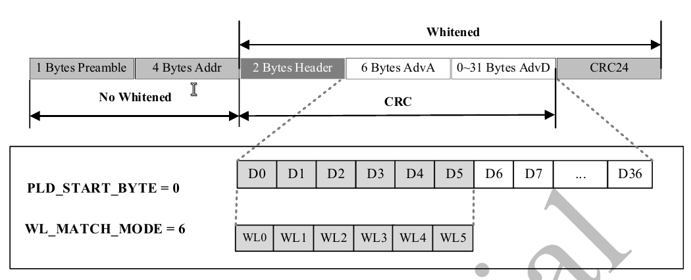
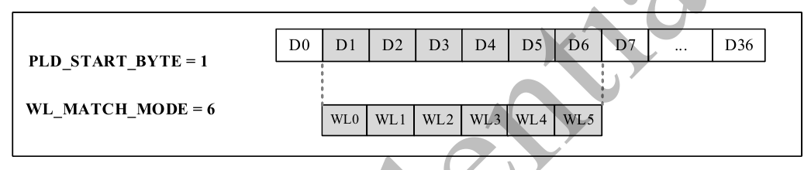
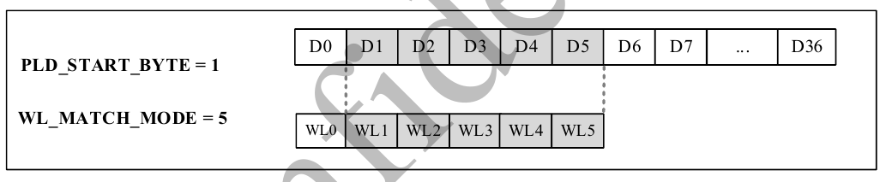
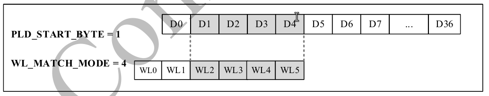

#### 9.5.2 Length Filtering

Length filtering refers to deciding whether to receive data packets based on data packet length filtering rules when receiving Bluetooth broadcast data packets. This filtering method can effectively avoid processing data packets that do not meet expected length, thereby reducing invalid data processing and improving device response speed and resource utilization efficiency.

**PAN211x Length Filtering Rules:**

PAN211x receives data packet's AdvA (6 bytes) plus valid data (excluding CRC) length sum = PL_LEN (Payload Length)

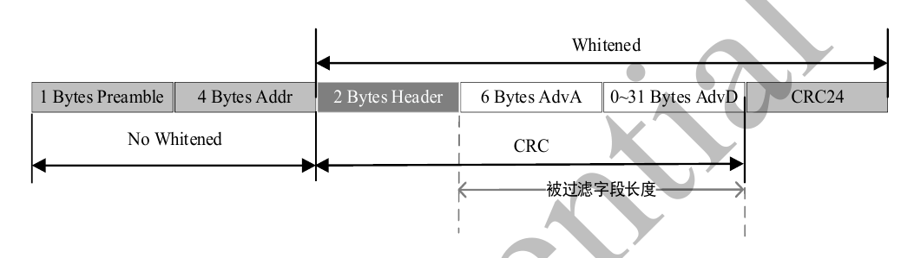

**Length filtering conditions configured through BLELEN_MATCH_MODE register:**

- BLELEN_MATCH_MODE = 0b'00: Disable length filtering function
- BLELEN_MATCH_MODE = 0b'01: Received PL_LEN equal to RXPLLEN_CFG will generate data interrupt and report to host
- BLELEN_MATCH_MODE = 0b'10: Received PL_LEN greater than RXPLLEN_CFG will generate data interrupt and report to host
- BLELEN_MATCH_MODE = 0b'11: Received PL_LEN less than RXPLLEN_CFG will generate data interrupt and report to host

### 9.6 Spread Spectrum Function

PAN211x supports Bluetooth LE 5.4 protocol S2, S8 spread spectrum modes, and can communicate with BLE mode after adapting frame format. This function can only be used in Bluetooth LE 5.4 S2/S8 extended broadcast protocol frame structure.

**Spread Spectrum Configuration:**
- S2 mode: S=2
- S8 mode: S=8
- Configured through PRI_CI_MODE register bits [1:0]:
  - 00: S8 mode
  - 01: S2 mode
  - 1x: Reserved

---

## 10. Data and Control Interface

PAN211x supports read/write operations on registers and TX/RX FIFO through either 3-wire SPI or I2C interfaces. By default, I2C communication mode and 3-wire SPI write mode are enabled. To use 3-wire SPI read mode, the REG_SPI3_REN register must be set to 1 after power-on.

### 10.1 Data Format

PAN211x uses a unified data format for all communications:

**Single-byte read/write format:**
```
[Register Address Byte] + [Data Byte]
```

**Multi-byte read/write format:**
```
[Register Address Byte] + [Data Byte 1] + [Data Byte 2] + ... + [Data Byte N]
```

**Byte Structure:**

| Address Byte (8 Bits) | Data Byte (8 Bits) |
|----------------------|-------------------|
| Address (7 Bits) + W/R (1 Bit) | D7 D6 D5 D4 D3 D2 D1 D0 |

**Address Byte:**
- Bit[7:1]: Register address
- Bit[0]: W/R command
  - [0]: Host reads data from PAN211x
  - [1]: Host writes data to PAN211x

**Data Byte:**
- Bit[7:0]: Data to be written or read via SPI

### 10.2 3-Wire SPI Interface

PAN211x supports 3-wire SPI write mode by default. To enable 3-wire SPI read mode, set the REG_SPI3_REN register to 1 after power-on.

**3-Wire SPI Signals:**
- **CSN**: SPI chip select signal, active low
- **SCK**: SPI clock signal, idle low, data sampled on rising edge
- **DATA**: SPI data input/output signal

#### 10.2.1 3-Wire SPI Write Timing

In SPI write operations:
- IC latches address bits on the rising edge of SCK
- IC latches data bits on the rising edge of SCK

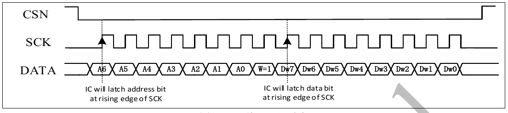

**Timing Sequence:**
1. CSN goes low to enable the transaction
2. Address bits A6-A0 are sent, followed by W/R bit (W=1 for write)
3. Data bits Dw7-Dw0 are sent
4. All bits are latched by IC on SCK rising edges
5. CSN goes high to complete the transaction

#### 10.2.2 3-Wire SPI Read Timing

In SPI read operations:
- IC latches address bits on the rising edge of SCK
- IC controls DATA output on the falling edge of SCK (8th falling edge)
- Host samples data bits on the rising edge of SCK

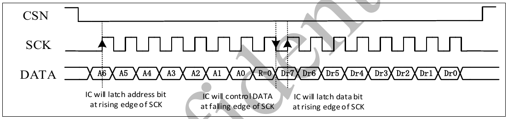

**Timing Sequence:**
1. CSN goes low to enable the transaction
2. Address bits A6-A0 are sent, followed by W/R bit (R=0 for read)
3. On the 8th falling edge of SCK, DATA pin transitions from input to output
4. IC outputs data bits Dr7-Dr0
5. Host samples data bits on SCK rising edges
6. CSN goes high to complete the transaction

**Important Note:**
During 3-wire SPI read operations, the DATA pin of PAN211x transitions from input to output state on the 8th falling edge of SCK. The host must switch DATA from output to input before the 8th falling edge of SCK to avoid electrical conflicts.

#### 10.2.3 3-Wire SPI Timing Requirements

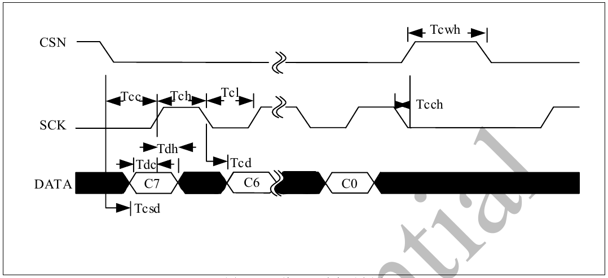

The following SPI timing requirements are evaluated with a maximum load of 10pF:

| Symbol | Parameter | Min | Max | Unit |
|--------|-----------|-----|-----|------|
| Tdc | Data Setup Time | 2 | - | ns |
| Tdh | Data Hold Time | 2 | - | ns |
| Tcsd | CSN to Data Valid | - | 42 | ns |
| Tcd | SCK to Data Valid | - | 58 | ns |
| Tcl | SCK Low Time | 40 | - | ns |
| Tch | SCK High Time | 40 | - | ns |
| Fsck | SCK Frequency | - | 8 | MHz |
| Tr, Tf | SCK Rising/Falling Time | - | 100 | ns |
| Tcc | CSN to SCK Setup Time | 2 | - | ns |
| Tcch | SCK to CSN Hold Time | 2 | - | ns |
| Tcwh | CSN Invalid Time | 50 | - | ns |

### 10.3 I2C Interface

PAN211x supports I2C communication by default. The I2C signals SCL and SDA are multiplexed with the SPI signals SCK and DATA, respectively.

**I2C Characteristics:**
- Device address: 0x71 (7-bit address)
- Fully compliant with standard I2C operation timing
- Supports standard I2C bus signals: START, RESTART, ACK, NACK, STOP

**Important Note:**
When using I2C, ensure that the host pulls the CSN signal high or leaves it floating (PAN211x has an internal pull-up resistor on the CSN pin).

#### 10.3.1 I2C Write Timing

I2C write sequence:

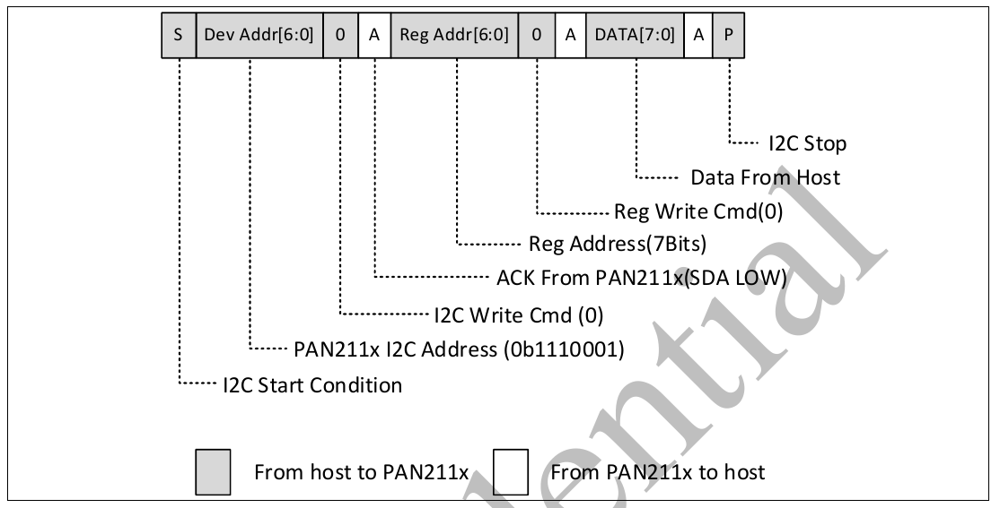

**Timing Sequence:**
1. **S**: I2C Start Condition
2. **Dev Addr[6:0]**: PAN211x I2C Address (0b1110001)
3. **0**: I2C Write Command
4. **A**: ACK from PAN211x (SDA LOW)
5. **Reg Addr[6:0]**: Register Address (7 bits)
6. **0**: Register Write Command
7. **A**: ACK from PAN211x (SDA LOW)
8. **DATA[7:0]**: Data from Host
9. **A**: ACK from PAN211x
10. **P**: I2C Stop Condition

#### 10.3.2 I2C Read Timing

I2C read sequence:

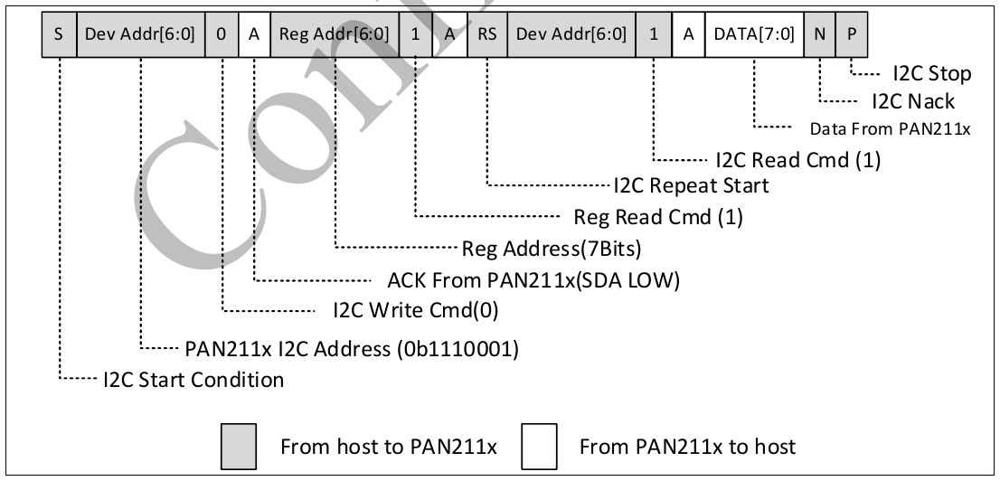

**Timing Sequence:**
1. **S**: I2C Start Condition
2. **Dev Addr[6:0]**: PAN211x I2C Address (0b1110001)
3. **0**: I2C Write Command
4. **A**: ACK from PAN211x (SDA LOW)
5. **Reg Addr[6:0]**: Register Address (7 bits)
6. **1**: Register Read Command
7. **A**: ACK from PAN211x (SDA LOW)
8. **RS**: I2C Repeat Start
9. **Dev Addr[6:0]**: PAN211x I2C Address
10. **1**: I2C Read Command
11. **A**: ACK from PAN211x
12. **DATA[7:0]**: Data from PAN211x
13. **N**: NACK from Host (I2C NACK)
14. **P**: I2C Stop Condition

### 10.4 FIFO Operation

During normal operation, PAN211x provides two 64-byte RAM blocks that can be combined into a single 128-byte buffer.

**FIFO Modes:**

1. **Enhanced Mode (128 bytes split)**:
   - TX FIFO: 64 bytes
   - RX FIFO: 64 bytes
   - Separate FIFOs for transmit and receive

2. **Normal Mode (128 bytes unified)**:
   - Single direction communication (TX or RX only)
   - FIFO can support up to 128 bytes

**FIFO Configuration:**
- When using data lengths exceeding 64 bytes, the FIFO_128_EN register must be set to 1 before writing to FIFO or receiving data
- FIFO can only store and read a single packet's information
- If FIFO already contains a packet, it must be read completely before writing new data, otherwise the previous packet will be overwritten

**FIFO Access:**
- FIFO read/write operations can be performed by MAC, SPI, or I2C in STB3 and subsequent operating modes
- FIFO read/write address: 0x01
- Operations can be performed through SPI or I2C

### 10.5 IRQ Interrupt

PAN211x uses a single external interrupt IO pin (IRQ) for all interrupt events. The interrupt pin is active low by default but can be configured for active high using the IRQ_HIGH_EN register.

**Interrupt Control:**
- Interrupts can be masked or enabled through interrupt mask registers
- The host can also poll the interrupt status register to determine current interrupt events

**Interrupt Types:**

| Interrupt Mask Register | Interrupt Status Register | Description |
|------------------------|--------------------------|-------------|
| TX_IRQ_MASK | TX_IRQ | Transmission complete flag |
| TX_MAX_RT_IRQ_MASK | TX_MAX_RT_IRQ | Maximum retransmission count reached IRQ |
| RX_ADDR_ERR_MASK | RX_ADDR_ERR_IRQ | Address match error in FEC mode |
| RX_CRC_ERR_IRQ_MASK | RX_CRC_ERR_IRQ | CRC error occurred during RX |
| RX_LENGTH_ERR_IRQ_MASK | RX_LENGTH_ERR_IRQ | Packet length error in enhanced mode |
| RX_PID_ERR_IRQ_MASK | RX_PID_ERR_IRQ | Duplicate packet received (same PID) |
| RX_TIMEOUT_IRQ_MASK | RX_TIMEOUT_IRQ | Address match timeout during RX |
| RX_IRQ_MASK | RX_IRQ | Correct data packet received |

**Note:**
Some PAN211x chip packages may not have a dedicated interrupt pin. In such cases, the IOMUX interrupt multiplexing feature can be used to multiplex the interrupt to the data pin. See the next section for details.

### 10.6 IOMUX (IO Multiplexing)

PAN211x supports interrupt multiplexing on communication pins for packages without a dedicated IRQ pin.

#### 10.6.1 DATA and IRQ Multiplexing

To enable IRQ time-division multiplexing on the DATA pin:

1. **Enable 3-wire SPI read mode**: Set REG_SPI3_REN register to 1
2. **Enable DATA pin interrupt multiplexing**: Set IRQ_DATA_MUX_EN register to 1

After configuration, the DATA pin functions as IRQ interrupt (active low) when the SPI bus is idle.

**Timing:**

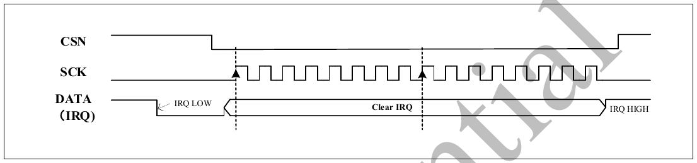

#### 10.6.2 SDA and IRQ Multiplexing

To enable IRQ time-division multiplexing on the SDA pin:

1. **Disable 3-wire SPI read mode**: Set REG_SPI3_REN register to 0
2. **Enable I2C bus**: Float or externally pull high the CSN pin
3. **Enable SDA pin interrupt multiplexing**: Set IRQ_I2C_MUX_EN register to 1

After configuration, the SDA pin functions as IRQ interrupt (active low) when the I2C bus is idle.

**Important Note:**
After enabling interrupt multiplexing on the SDA pin, the operation timing no longer complies with standard I2C timing. The host must use software simulation for I2C operations.

**Timing:**
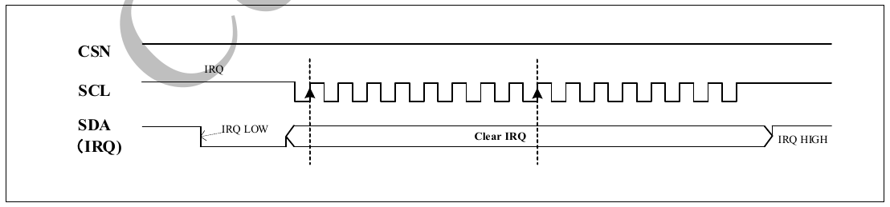

---

## 11. Register Map

Users can perform read/write operations on registers through SPI/I2C interface. Commonly used registers are primarily located in PAGE0 (abbreviated as P0 in the tables below).

### 11.1 Register Overview

The PAN211x register map is organized into pages, with PAGE0 containing all user-accessible registers from address 0x00 to 0x7F. PAGE1 is reserved for SDK use only and should not be accessed by user applications.

### 11.2 Control and Configuration Registers

#### 0x00 - PAGE_CFG: Parameter Page Switch Register

| Bit | Field | Default | R/W | Description |
|-----|-------|---------|-----|-------------|
| 7:1 | RESERVED | 0 | W/R | Reserved, cannot be written |
| 0 | PAGE_SEL | 0 | W/R | Page selection:<br>0: Select Page0<br>1: Select Page1 (forbidden except SDK operations) |

#### 0x01 - TRX_FIFO: FIFO Read/Write Access Point

| Bit | Field | Default | R/W | Description |
|-----|-------|---------|-----|-------------|
| 7:0 | FIFO Read/Write Access Point | 0x00 | W/R | FIFO read/write address |

#### 0x02 - STATE_CFG: State Control Register

| Bit | Field | Default | R/W | Description |
|-----|-------|---------|-----|-------------|
| 7 | TX_FIFO_READY | 0 | W/R | Used only in continuous transmission mode. Transition from 0 to 1 triggers transmission of data in FIFO |
| 6 | EN_LS_3V | 0 | W/R | 0: Turn off internal high voltage module<br>1: Turn on internal high voltage module |
| 5 | POR_RSTL | 0 | W/R | Low voltage area reset:<br>0: Reset<br>1: No reset |
| 4 | ISO_TO_0 | 0 | W/R | 0: Low voltage area register signal isolation<br>1: Low voltage area register signal not isolated<br>Note: Configure as 0 in Deepsleep mode; configure as 1 in other modes |
| 3 | RESERVED | 0 | W/R | Reserved |
| 2:0 | OPERATE_MODE | 0 | W/R | Operating mode:<br>0: Deepsleep mode<br>1: Sleep mode<br>2: STB1 mode (LDO working)<br>3: STB2 mode (OSC working)<br>4: STB3 mode (OSC output)<br>5: TX mode<br>6: RX mode |

#### 0x03 - SYS_CFG: System Control Register

| Bit | Field | Default | R/W | Description |
|-----|-------|---------|-----|-------------|
| 7:3 | RESERVED | 0 | W/R | Forbidden to operate |
| 2 | IRQ_DATA_MUX_EN | 0 | W/R | 0: DATA and IRQ not multiplexed<br>1: SPI mode, DATA and IRQ time-division multiplexed<br>Note: When IRQ_DATA_MUX_EN is 1, I2C bus cannot be used |
| 1 | SOFT_RSTL | 1 | W/R | Low voltage area logic reset:<br>0: Reset digital control logic<br>1: Do not reset digital control logic |
| 0 | RESERVED | 0 | W/R | Reserved |

#### 0x04 - SPI_CFG: SPI Bus Configuration Register

| Bit | Field | Default | R/W | Description |
|-----|-------|---------|-----|-------------|
| 7 | REG_SPI3_REN | 0 | W/R | Bus mode selection register:<br>0: Disable 3-wire SPI read mode<br>1: Enable 3-wire SPI read mode |
| 6 | REG_DATA_PUEN | 1 | W/R | DATA pin pull-up resistor enable:<br>0: Disable DATA pull-up resistor<br>1: Enable DATA pull-up resistor<br>Note: Effective when REG_IN_PAD_MODE register is 0 |
| 5 | REG_CSN_PUEN | 1 | W/R | CSN pin pull-up resistor enable:<br>0: Disable CSN pull-up resistor<br>1: Enable CSN pull-up resistor<br>Note: Effective when REG_IN_PAD_MODE register is 0 |
| 4 | REG_SCK_PUEN | 1 | W/R | SCK pin pull-up resistor enable:<br>0: Disable SCK pull-up resistor<br>1: Enable SCK pull-up resistor |
| 3 | REG_IN_PAD_MODE | 0 | W/R | SPI input pin manual configuration mode enable:<br>0: CSN_PUEN uses REG_CSN_PUEN configuration, MOSI_DIEN/MOSI_OUT/MOSI_OE auto-configured<br>1: CSN_PUEN is 1, MOSI_DIEN is 1, MOSI_OUT/MOSI_OE are 0 |
| 2:0 | RESERVED | 011 | W/R | Default 011, forbidden to operate |

#### 0x06 - I2C_CFG: I2C Bus Configuration Register

| Bit | Field | Default | R/W | Description |
|-----|-------|---------|-----|-------------|
| 7:4 | RESERVED | 0000 | - | Reserved |
| 3 | IRQ_I2C_MUX_EN | 0 | - | 0: IRQ and I2C SDA not multiplexed<br>1: IRQ and I2C SDA time-division multiplexed<br>Note: After SDA uses interrupt function, I2C bus idle and SDA low indicates interrupt occurred |
| 2:0 | RESERVED | 101 | - | Reserved |

#### 0x07 - WMODE_CFG0: Work Mode Configuration Register 0

| Bit | Field | Default | R/W | Description |
|-----|-------|---------|-----|-------------|
| 7:6 | CRC_MODE | 01 | W/R | CRC mode:<br>00: CRC DISABLE<br>01: CRC-1BYTE<br>10: CRC-2BYTE<br>11: CRC-3BYTE |
| 5:4 | WORK_MODE | 00 | W/R | Work mode selection:<br>00: XN297L mode<br>11: BLE mode |
| 3 | WHITEN_ENABLE | 1 | W/R | Whitening function enable:<br>0: Disable<br>1: Enable |
| 2 | CRC_SKIP_ADDR | 0 | W/R | CRC skip address selection:<br>0: CRC does not skip address<br>1: CRC skips address |
| 1 | TX_NOACK | 0 | W/R | 1: Enhanced mode TX_NOACK bit is 1<br>0: Enhanced mode TX_NOACK bit is 0<br>Note: Receiver does not reply ACK when receiving TX_NOACK=1; must reply ACK when receiving TX_NOACK=0 |
| 0 | ENDIAN | 1 | W/R | Bit endianness:<br>0: Little-endian bit order, used in BLE mode<br>1: Big-endian bit order, used in XN297L mode |

#### 0x08 - WMODE_CFG1: Work Mode Configuration Register 1

| Bit | Field | Default | R/W | Description |
|-----|-------|---------|-----|-------------|
| 7 | RX_GOON | 1 | W/R | Whether RF exits receive state when CRC error, RX length error, or address error occurs:<br>0: Exit RX on error<br>1: Continue receiving on error |
| 6 | PRI_EXIT_RX | 0 | W/R | Software sets this bit to 1 to force exit from receive state |
| 5 | FIFO_128_EN | 0 | W/R | 0: Maximum 64-byte FIFO available<br>1: Maximum 128-byte FIFO available<br>Note: Set to 1 in XN297L normal mode and BLE mode; set to 0 in enhanced mode |
| 4 | DPY_EN | 0 | W/R | In enhanced mode: Configure this bit for hardware to autonomously determine receive packet length, no need to configure receive length RX_PAYLOAD_LENGTH in software<br>Note: Ignored in XN297L normal mode |
| 3 | ENHANCE | 0 | W/R | 0: Enable normal frame format<br>1: Enable enhanced frame format |
| 2 | RESERVED | 0 | W/R | Must be configured as 0 |
| 1:0 | ADDR_BYTE_LENGTH | 11 | W/R | Address width setting:<br>00: 2 bytes<br>01: 3 bytes<br>10: 4 bytes<br>11: 5 bytes<br>Note: If address width is set less than 5 bytes, low byte addresses are used |


#### 0x09 - RXPLLEN_CFG: Receive Length Configuration Register

| Bit | Field | Default | R/W | Description |
|-----|-------|---------|-----|-------------|
| 7:0 | RX_PAYLOAD_LENGTH | 0x00 | W/R | Receive PAYLOAD length information |

#### 0x0A - TXPLLEN_CFG: Transmit Length Configuration Register

| Bit | Field | Default | R/W | Description |
|-----|-------|---------|-----|-------------|
| 7:0 | TX_PAYLOAD_LENGTH | 0x00 | W/R | Transmit PAYLOAD length information |

#### 0x0B - RFIRQ_CFG: Interrupt Mask Register

| Bit | Field | Default | R/W | Description |
|-----|-------|---------|-----|-------------|
| 7 | TX_IRQ_MSK | 0 | W/R | 1: Total IRQ does not have this interrupt information<br>0: Total IRQ has this interrupt information |
| 6 | TX_MAX_RT_IRQ_MSK | 0 | W/R | 1: Total IRQ does not have this interrupt information<br>0: Total IRQ has this interrupt information |
| 5 | RX_ADDR_ERR_MSK | 0 | W/R | 1: Total IRQ does not have this interrupt information<br>0: Total IRQ has this interrupt information |
| 4 | RX_CRC_ERR_IRQ_MSK | 0 | W/R | 1: Total IRQ does not have this interrupt information<br>0: Total IRQ has this interrupt information |
| 3 | RX_LEN_ERR_IRQ_MSK | 0 | W/R | 1: Total IRQ does not have this interrupt information<br>0: Total IRQ has this interrupt information |
| 2 | RX_PID_ERR_IRQ_MSK | 0 | W/R | 1: Total IRQ does not have this interrupt information<br>0: Total IRQ has this interrupt information |
| 1 | RX_TIMEOUT_IRQ_MSK | 0 | W/R | 1: Total IRQ does not have this interrupt information<br>0: Total IRQ has this interrupt information |
| 0 | RX_IRQ_MSK | 0 | W/R | 1: Total IRQ does not have this interrupt information<br>0: Total IRQ has this interrupt information |

#### 0x0C - PID_CFG: PID Identifier Configuration Register

| Bit | Field | Default | R/W | Description |
|-----|-------|---------|-----|-------------|
| 7 | PID_MANUAL_EN | 0 | W/R | 0: Disable manual PID function<br>1: Enable manual PID function |
| 6:4 | ADDR_ERR_THR | 0 | W/R | ACC ADDR matching error threshold maximum:<br>0: Complete match<br>1: Allow 1 bit address error<br>...<br>7: Allow 7 bits address error |
| 3:2 | RX_PID_MANUAL | 0 | W/R | Only effective when PID_MANUAL_EN=1<br>RX_PID value manually configured by RX before receiving data |
| 1:0 | TX_PID_MANUAL | 0 | W/R | Only effective when PID_MANUAL_EN=1 |

#### 0x0D - TRXTWTL_CFG: TX/RX Switching Wait Time Configuration Register (Low)

| Bit | Field | Default | R/W | Description |
|-----|-------|---------|-----|-------------|
| 7:0 | TRX_TRANS_WAIT_TIME[7:0] | 0 | W/R | Lower 8-bit counter for delay time between TX/RX switching in enhanced mode, unit: microseconds<br>Note:<br>1. Enhanced TX side TX-to-RX delay time is typically set to 0<br>2. Enhanced RX side RX-to-TX delay time depends on data length read and ACK data length; longer processing time requires longer delay setting |

#### 0x0E - TRXTWTH_CFG: TX/RX Switching Wait Time Configuration Register (High)

| Bit | Field | Default | R/W | Description |
|-----|-------|---------|-----|-------------|
| 7 | RESERVED | 0 | W/R | Reserved |
| 6:0 | TRX_TRANS_WAIT_TIME[14:8] | 0 | W/R | Upper 7-bit counter for delay time between TX/RX switching in enhanced mode |

### 11.3 Address Configuration Registers

#### 0x0F-0x13 - PIPE0_RXADDR0-4_CFG: Pipe0 RX Address Configuration

| Address | Register | Bit | Default | R/W | Description |
|---------|----------|-----|---------|-----|-------------|
| 0x0F | PIPE0_RXADDR0_CFG | 7:0 | 0xCC | W/R | RX_ADDR[7:0] |
| 0x10 | PIPE0_RXADDR1_CFG | 7:0 | 0xCC | W/R | RX_ADDR[15:8] |
| 0x11 | PIPE0_RXADDR2_CFG | 7:0 | 0xCC | W/R | RX_ADDR[23:16] |
| 0x12 | PIPE0_RXADDR3_CFG | 7:0 | 0xCC | W/R | RX_ADDR[31:24] |
| 0x13 | PIPE0_RXADDR4_CFG | 7:0 | 0xCC | W/R | RX_ADDR[39:32] |

#### 0x14-0x18 - TXADDR0-4_CFG: TX Address Configuration

| Address | Register | Bit | Default | R/W | Description |
|---------|----------|-----|---------|-----|-------------|
| 0x14 | TXADDR0_CFG | 7:0 | 0xCC | W/R | TX_ADDR[7:0] |
| 0x15 | TXADDR1_CFG | 7:0 | 0xCC | W/R | TX_ADDR[15:8] |
| 0x16 | TXADDR2_CFG | 7:0 | 0xCC | W/R | TX_ADDR[23:16] |
| 0x17 | TXADDR3_CFG | 7:0 | 0xCC | W/R | TX_ADDR[31:24] |
| 0x18 | TXADDR4_CFG | 7:0 | 0xCC | W/R | TX_ADDR[39:32] |

#### 0x19 - PKT_EXT_CFG: Packet Extension Configuration Register

| Bit | Field | Default | R/W | Description |
|-----|-------|---------|-----|-------------|
| 7 | W_RX_MAX_CTRL_EN | 0 | W/R | Maximum packet length function switch in receive mode:<br>1: On<br>0: Off |
| 6 | HDR_LEN_EXIST | 0 | W/R | HEADER and LENGTH configuration:<br>0: Disable HEADER and LENGTH fields<br>1: Enable HEADER and LENGTH fields |
| 5:4 | HDR_LEN_NUMB | 00 | W/R | Effective when HDR_LEN_EXIST is 1:<br>00: No HEADER and LENGTH fields<br>01: Enable LENGTH in first byte after address, no HEADER<br>10: Enable LENGTH in second byte after address, HEADER in first byte after address<br>11: Enable LENGTH in third byte after address, HEADER in first two bytes after address |
| 3 | PRI_TX_FEC | 0 | W/R | 0: Disable TX spread spectrum function<br>1: Enable TX spread spectrum function |
| 2 | PRI_RX_FEC | 0 | W/R | 0: Disable RX spread spectrum function<br>1: Enable RX spread spectrum function |
| 1:0 | PRI_CI_MODE | 00 | W/R | Spread spectrum mode selection:<br>00: S8<br>01: S2<br>1x: Reserved |

#### 0x1A - WHITEN_CFG: Whitening Configuration Register

| Bit | Field | Default | R/W | Description |
|-----|-------|---------|-----|-------------|
| 7 | WHITEN_SKIP_ADDR | 0 | W/R | Whether whitening skips address:<br>0: Whitening does not skip address<br>1: Whitening skips address |
| 6:0 | WHITEN_SEED | 0x7F | W/R | Whitening initial value |

#### 0x1B - TXHDR0_CFG: Transmit HEADER0 Configuration Register

| Bit | Field | Default | R/W | Description |
|-----|-------|---------|-----|-------------|
| 7:0 | TX_HEADER0 | 0x00 | W/R | Effective when HDR_LEN_EXIST=1 and HDR_LEN_NUMB is 10 or 11 |

#### 0x1C - TXHDR1_CFG: Transmit HEADER1 Configuration Register

| Bit | Field | Default | R/W | Description |
|-----|-------|---------|-----|-------------|
| 7:0 | TX_HEADER1 | 0x00 | W/R | Effective when HDR_LEN_EXIST=1 and HDR_LEN_NUMB is 11 |

#### 0x1D - TXRAMADDR_CFG: TX FIFO Start Address Configuration Register

| Bit | Field | Default | R/W | Description |
|-----|-------|---------|-----|-------------|
| 7:0 | TX_RAM_START_ADDR | 0x00 | W/R | TX side FIFO read start address |

#### 0x1E - RXRAMADDR_CFG: RX FIFO Start Address Configuration Register

| Bit | Field | Default | R/W | Description |
|-----|-------|---------|-----|-------------|
| 7:0 | RX_RAM_START_ADDR | 0x00 | W/R | RX side FIFO write start address |

#### 0x1F - RXPIPE_CFG: Multi-Channel Enable Register

| Bit | Field | Default | R/W | Description |
|-----|-------|---------|-----|-------------|
| 7:6 | RESERVED | 0 | W/R | Forbidden to operate |
| 5 | PIPE5_EN | 0 | W/R | Pipe5 enable in multi-channel receive mode |
| 4 | PIPE4_EN | 0 | W/R | Pipe4 enable in multi-channel receive mode |
| 3 | PIPE3_EN | 0 | W/R | Pipe3 enable in multi-channel receive mode |
| 2 | PIPE2_EN | 0 | W/R | Pipe2 enable in multi-channel receive mode |
| 1 | PIPE1_EN | 0 | W/R | Pipe1 enable in multi-channel receive mode |
| 0 | PIPE0_EN | 1 | W/R | Pipe0 enable in multi-channel receive mode |


#### 0x20-0x24 - PIPE1_RXADDR0-4_CFG: Pipe1 RX Address Configuration

| Address | Register | Bit | Default | R/W | Description |
|---------|----------|-----|---------|-----|-------------|
| 0x20 | PIPE1_RXADDR0_CFG | 7:0 | 0xCC | W/R | PIPE1_ADDR[7:0] - Multi-channel receive mode pipe1 low 8 bits |
| 0x21 | PIPE1_RXADDR1_CFG | 7:0 | 0xCC | W/R | PIPE1_ADDR[15:8] - pipe1~pipe5 address[15:8] bits |
| 0x22 | PIPE1_RXADDR2_CFG | 7:0 | 0xCC | W/R | PIPE1_ADDR[23:16] - pipe1~pipe5 address[23:16] bits |
| 0x23 | PIPE1_RXADDR3_CFG | 7:0 | 0xCC | W/R | PIPE1_ADDR[31:24] - pipe1~pipe5 address[31:24] bits |
| 0x24 | PIPE1_RXADDR4_CFG | 7:0 | 0xCC | W/R | PIPE1_ADDR[39:32] - pipe1~pipe5 address[39:32] bits |

#### 0x25-0x28 - PIPE2-5_RXADDR0_CFG: Pipe2-5 RX Address Configuration

| Address | Register | Bit | Default | R/W | Description |
|---------|----------|-----|---------|-----|-------------|
| 0x25 | PIPE2_RXADDR0_CFG | 7:0 | 0xCC | W/R | PIPE2_ADDR[7:0] - Multi-channel receive mode pipe2 low 8 bits |
| 0x26 | PIPE3_RXADDR0_CFG | 7:0 | 0xCC | W/R | PIPE3_ADDR[7:0] - Multi-channel receive mode pipe3 low 8 bits |
| 0x27 | PIPE4_RXADDR0_CFG | 7:0 | 0xCC | W/R | PIPE4_ADDR[7:0] - Multi-channel receive mode pipe4 low 8 bits |
| 0x28 | PIPE5_RXADDR0_CFG | 7:0 | 0xCC | W/R | PIPE5_ADDR[7:0] - Multi-channel receive mode pipe5 low 8 bits |

Note: Pipes 2-5 share the high address bytes configured in PIPE1_RXADDR1-4_CFG registers, and only differ in the lowest byte configured here.

### 11.4 Transmission and Reception Mode Registers

#### 0x29 - TXAUTO_CFG: Automatic Transmission Configuration Register

| Bit | Field | Default | R/W | Description |
|-----|-------|---------|-----|-------------|
| 7:4 | ARD | 0000 | W/R | Auto retransmit delay:<br>0000: 250μs<br>0001: 500μs<br>0010: 750μs<br>...<br>1111: 4000μs |
| 3:0 | ARC | 0011 | W/R | Auto retransmit count setting:<br>0000: Communication mode without ACK<br>0001~1111: Communication mode with ACK<br>0001: Receive ACK after transmit, no retransmit<br>0010: Receive ACK after transmit, maximum 1 retransmit<br>...<br>1111: Receive ACK after transmit, maximum 14 retransmits |

#### 0x2A - TRXMODE_CFG: TX/RX Mode Configuration Register

| Bit | Field | Default | R/W | Description |
|-----|-------|---------|-----|-------------|
| 7 | REG_TX_CFG_MODE | 0 | W/R | 0: Single transmission mode<br>1: Continuous transmission mode |
| 6:5 | REG_RX_CFG_MODE | 0 | W/R | Normal mode reception:<br>0: Single reception mode<br>1: Single reception mode with timeout<br>2: Continuous reception mode<br>Enhanced mode reception:<br>0: Continuous reception mode<br>1: Continuous reception mode with timeout |
| 4 | PRE_2BYTE_MODE | 0 | W/R | 297L mode extends PREAMBLE function at 2Mbps rate:<br>1: 297L mode PREAMBLE repeats twice, can improve 2M mode packet reception rate<br>0: 297L mode PREAMBLE sends only once |
| 3 | W_PRE_SYNC_12B_EN | 0 | W/R | 12-bit presync enable:<br>1: Generate presync signal when 12 bits of address match<br>0: Disable this function |
| 2 | W_PRE_SYNC_8B_EN | 0 | W/R | 8-bit presync enable:<br>1: Generate presync signal when 8 bits of address match<br>0: Disable this function |
| 1 | W_PRE_SYNC_4B_EN | 0 | W/R | 4-bit presync enable:<br>1: Generate presync signal when 4 bits of address match<br>0: Disable this function |
| 0 | W_PRE_SYNC_EN | 1 | W/R | Presync output enable. If W_PRE_SYNC_EN is 1 and W_PRE_SYNC_12B_EN, W_PRE_SYNC_8B_EN, W_PRE_SYNC_4B_EN are all 0, generates presync signal when 16 bits of address match.<br>Function: Pre-match signal raised before complete address match, used internally to lock AGC and prevent AGC fluctuation during address phase |

#### 0x2B - RXTIMEOUTL_CFG: Receive Timeout Configuration Register (Low)

| Bit | Field | Default | R/W | Description |
|-----|-------|---------|-----|-------------|
| 7:0 | REG_RX_TIMEOUT[7:0] | 0xD0 | W/R | Receive timeout setting, low 8 bits, unit: microseconds |

#### 0x2C - RXTIMEOUTH_CFG: Receive Timeout Configuration Register (High)

| Bit | Field | Default | R/W | Description |
|-----|-------|---------|-----|-------------|
| 7:0 | REG_RX_TIMEOUT[15:8] | 0x07 | W/R | Receive timeout setting, high 8 bits |

### 11.5 BLE Mode Filter Configuration Registers

#### 0x2D - BLEMATCH_CFG0: BLE Mode Filter Configuration Register 0

| Bit | Field | Default | R/W | Description |
|-----|-------|---------|-----|-------------|
| 7 | SNIF_EN | 0 | W/R | SNIFFER enable:<br>1: Enable<br>0: Disable |
| 6:4 | WL_MATCH_MODE | 000 | W/R | BLE mode RX whitelist filter mode selection:<br>000: No filter, report all<br>001: Match only WL_ADVA[47:40] to report<br>010: Match only WL_ADVA[47:32] to report<br>011: Match only WL_ADVA[47:24] to report<br>100: Match only WL_ADVA[47:16] to report<br>101: Match only WL_ADVA[47:8] to report<br>110: Must match entire WL_ADVA[47:0] to report<br>111: Same as 000, no filter, report all |
| 3:2 | BLELEN_MATCH_MODE | 00 | W/R | BLE mode packet length-based filter mode selection:<br>00: Disabled<br>01: Trigger receive interrupt when received packet length equals RXPLLEN_CFG register<br>10: Trigger receive interrupt when received packet length greater than RXPLLEN_CFG register<br>11: Trigger receive interrupt when received packet length less than RXPLLEN_CFG register |
| 1:0 | RESERVED | 00 | W/R | Forbidden to modify |

#### 0x2E - BLEMATCH_CFG1: BLE Filter Configuration Register 1

| Bit | Field | Default | R/W | Description |
|-----|-------|---------|-----|-------------|
| 7:0 | RESERVED | 0x28 | W/R | Forbidden to modify |

#### 0x2F-0x34 - WLIST0-5_CFG: BLE Whitelist Data Configuration

| Address | Register | Bit | Default | R/W | Description |
|---------|----------|-----|---------|-----|-------------|
| 0x2F | WLIST0_CFG | 7:0 | 0x00 | W/R | WL_ADVA[7:0] - BLE mode whitelist data 0 |
| 0x30 | WLIST1_CFG | 7:0 | 0x00 | W/R | WL_ADVA[15:8] - BLE mode whitelist data 1 |
| 0x31 | WLIST2_CFG | 7:0 | 0x00 | W/R | WL_ADVA[23:16] - BLE mode whitelist data 2 |
| 0x32 | WLIST3_CFG | 7:0 | 0x00 | W/R | WL_ADVA[31:24] - BLE mode whitelist data 3 |
| 0x33 | WLIST4_CFG | 7:0 | 0x00 | W/R | WL_ADVA[39:32] - BLE mode whitelist data 4 |
| 0x34 | WLIST5_CFG | 7:0 | 0x00 | W/R | WL_ADVA[47:40] - BLE mode whitelist data 5 |

#### 0x35 - BLEMATCHSTART_CFG: BLE Whitelist Filter Start Address Configuration Register

| Bit | Field | Default | R/W | Description |
|-----|-------|---------|-----|-------------|
| 7 | RESERVED | 0 | W/R | Forbidden to modify |
| 6 | RESERVED | 0 | W/R | Forbidden to modify |
| 5:0 | PLD_START_BYTE | 000111 | W/R | BLE mode whitelist filter start byte configuration:<br>Configure as 1~6: Filter starts from AdvA<br>Configure as 7~39: Filter starts from PAYLOAD<br>Note: See section 8.5 for details |

### 11.6 RF Configuration Registers

#### 0x36 - RF_DATARATE_CFG: Air Data Rate Configuration Register

| Bit | Field | Default | R/W | Description |
|-----|-------|---------|-----|-------------|
| 7:6 | RESERVED | 01 | - | Reserved |
| 5:4 | DATARATE | 00 | - | 00: 1Mbps<br>01: 2Mbps<br>11: 250Kbps |
| 3:0 | RESERVED | 0101 | - | Reserved |

#### 0x39 - RF_CHANNEL_CFG: Frequency Channel Configuration Register

| Bit | Field | Default | R/W | Description |
|-----|-------|---------|-----|-------------|
| 7:0 | RF_CH | 0x00 | W/R | Channel number<br>Channel frequency F0 = 2400 + RF_CH [MHz] |

#### 0x45 - IRQ_MUX_CFG: IRQ Pin Multiplexing Configuration Register

| Bit | Field | Default | R/W | Description |
|-----|-------|---------|-----|-------------|
| 7:4 | RESERVED | 0000 | W/R | Forbidden to modify |
| 3:2 | OCLK_SEL | 00 | W/R | Clock output frequency:<br>00: 1kHz output frequency<br>01: 4kHz output frequency<br>10: 8MHz output frequency<br>11: 16MHz output frequency |
| 1:0 | IRQ_MUX | 00 | W/R | IRQ pin function selection:<br>00: Interrupt function (IRQ)<br>01: Clock output function (OCLK)<br>10: PA control function |

#### 0x6F - MISC_CFG: Miscellaneous Configuration Register

| Bit | Field | Default | R/W | Description |
|-----|-------|---------|-----|-------------|
| 7 | RESERVERD | 0 | W/R | Reserved |
| 6 | ENH_NOACK_RX_CONT_DIS | 0 | W/R | 0: Enhanced mode receiver does not exit receive mode when receiving TX_NOACK packet<br>1: Enhanced mode receiver exits receive mode and returns to STB3 state when receiving TX_NOACK packet |
| 5 | I_NDC_PREAMBLE_SEL | 0 | W/R | 1: BLE mode, used to configure BLE mode preamble<br>0: XN297L mode |
| 4 | PID_LOW_SEL | 0 | W/R | 0: PID in middle<br>1: PID in lowest two bits |
| 3 | IRQ_HIGH_EN | 0 | W/R | IRQ pin level mode:<br>0: All interrupts active low<br>1: All interrupts active high<br>Note: Interrupt multiplexing mode does not support this configuration |
| 2:0 | ACK_PIPE | 0 | W/R | Reply pipe number for receiver in multi-pipe mode. If receiver wants to reply data packet to pipe 2, configure ACK_PIPE to 2, then write data packet to FIFO |


### 11.7 Status and Interrupt Registers

#### 0x73 - RFIRQFLG: RF Interrupt Status Register

| Bit | Field | Default | R/W | Description |
|-----|-------|---------|-----|-------------|
| 7 | TX_IRQ | 0 | W/R | Data packet transmission complete flag, write 1 to clear |
| 6 | TX_MAX_RT_IRQ | 0 | W/R | Auto retransmit reached maximum count flag, write 1 to clear |
| 5 | RX_ADDR_ERR_IRQ | 0 | W/R | Address match error in FEC mode flag, write 1 to clear |
| 4 | RX_CRC_ERR_IRQ | 0 | W/R | CRC error occurred during RX flag, write 1 to clear |
| 3 | RX_LENGTH_ERR_IRQ | 0 | W/R | Receive packet length error in enhanced mode flag, write 1 to clear |
| 2 | RX_PID_ERR_IRQ | 0 | W/R | Received identical PID packet flag, write 1 to clear |
| 1 | RX_TIMEOUT_IRQ | 0 | W/R | Failed to receive data packet within set time flag, write 1 to clear |
| 0 | RX_IRQ | 0 | W/R | Correct data received flag, write 1 to clear |

#### 0x74 - STATUS0: Status Register 0

| Bit | Field | Default | R/W | Description |
|-----|-------|---------|-----|-------------|
| 7 | RX_CI_ERR | 0 | R | CI error status in spread spectrum mode |
| 6:4 | RX_SYNC_ADDR | 00 | R | Channel number of received data |
| 3:2 | RX_PID | 11 | R | RX PID |
| 1:0 | TX_PID | 00 | R | TX PID |

#### 0x75 - STATUS1: Status Register 1

| Bit | Field | Default | R/W | Description |
|-----|-------|---------|-----|-------------|
| 7:0 | RX_HEADER[7:0] | 0x00 | R | Low 8 bits of received HEADER |

#### 0x76 - STATUS2: Status Register 2

| Bit | Field | Default | R/W | Description |
|-----|-------|---------|-----|-------------|
| 7:0 | RX_HEADER[15:8] | 0x00 | R | High 8 bits of received HEADER |

#### 0x77 - STATUS3: Status Register 3

| Bit | Field | Default | R/W | Description |
|-----|-------|---------|-----|-------------|
| 7:0 | RX_PAYLOAD_LENGTH | 0x00 | R | Length of received packet |

### 11.8 RSSI Registers

#### 0x7A - PKT_RSSI_L: Signal Strength Low 8 Bits Register

| Bit | Field | Default | R/W | Description |
|-----|-------|---------|-----|-------------|
| 7:0 | PKT_RSSI_L | 0x00 | R | Signal strength (dBm) formula:<br>(PKT_RSSI - 16384) / 4<br>where PKT_RSSI = PKT_RSSI_L + PKT_RSSI_H[5:0] * 256 |

#### 0x7B - PKT_RSSI_H: Signal Strength High 6 Bits Register

| Bit | Field | Default | R/W | Description |
|-----|-------|---------|-----|-------------|
| 7:6 | RESERVERD | 00 | R | Reserved |
| 5:0 | PKT_RSSI_H | 00 | R | High 6 bits of signal strength |

#### 0x7E - RT_RSSI_L: Noise Strength Low 8 Bits Register

| Bit | Field | Default | R/W | Description |
|-----|-------|---------|-----|-------------|
| 7:0 | RT_RSSI_L | 0x00 | R | Noise strength (dBm) formula:<br>(RT_RSSI - 16384) / 4<br>where RT_RSSI = RT_RSSI_L + RT_RSSI_H[5:0] * 256 |

#### 0x7F - RT_RSSI_H: Noise Strength High 6 Bits Register

| Bit | Field | Default | R/W | Description |
|-----|-------|---------|-----|-------------|
| 7:6 | RESERVERD | 00 | R | Reserved |
| 5:0 | RT_RSSI_H | 00 | R | High 6 bits of noise strength |

### 11.9 Register Access Notes

**Important Notes for Register Programming:**

1. **Page Selection**: Most user registers are in PAGE0 (address 0x00-0x7F). PAGE1 is reserved for SDK use only.

2. **Reserved Bits**: Always maintain default values for reserved bits. Do not modify unless explicitly documented.

3. **Operating Mode Changes**: When changing operating modes via STATE_CFG register, ensure proper timing delays for mode transitions.

4. **FIFO Access**: FIFO read/write operations should only be performed in STB3 or higher operating modes.

5. **Interrupt Clearing**: Interrupt flags in RFIRQFLG register are cleared by writing 1 to the respective bit.

6. **RSSI Calculation**: Both signal and noise strength are 14-bit values requiring combination of low and high registers, with offset and scaling applied.

7. **Multi-channel Configuration**: When using multiple receive pipes (pipe1-5), configure the shared high address bytes first, then individual low bytes.

8. **BLE Mode Whitelist**: Configure whitelist registers sequentially from WL0 to WL5 for proper address filtering.

9. **Timing Parameters**: TX/RX switching delays, retransmission delays, and timeout values should be calculated based on packet size and data rate.

10. **Pin Multiplexing**: When enabling interrupt multiplexing on DATA or SDA pins, be aware of timing constraints and software requirements.

---


## 12. Reference Schematic

The reference schematic provided is based on the SOP8 package. The SOT23-8 package uses the same schematic configuration.

### 12.1 Typical Application Circuit

The following schematic shows the typical application circuit for PAN211x:
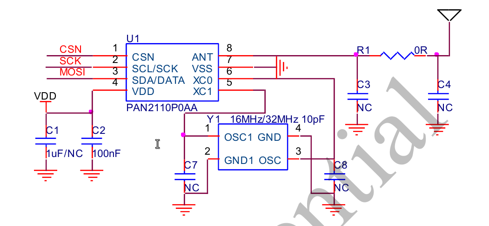

### 12.2 Component Selection Guidelines

**Power Supply Capacitors:**
- C1 (1µF): Bulk capacitance for power supply stability
  - Can be omitted (NC) if external power supply has adequate decoupling
  - Recommended: X5R or X7R ceramic capacitor

- C2 (100nF): High-frequency decoupling capacitor
  - Required, place as close as possible to VDD pin
  - Recommended: X5R or X7R ceramic capacitor, 0402 or 0603 package

**Crystal Oscillator:**
- Frequency: 16MHz or 32MHz (check specific PAN211x variant)
- Load capacitance: Typically 10pF (verify with crystal datasheet)
- ESR: <100Ω recommended
- C3, C4: Match crystal load capacitance requirements
  - Formula: CL = (C3 × C4)/(C3 + C4) + Cstray
  - Typical: 10pF ±5% C0G/NP0 ceramic capacitors

> **16 MHz crystal — additional register requirements:** The SDK init sequence targets a 32 MHz crystal. When using a 16 MHz crystal, three extra register writes are required during `Init()` that are absent from the SDK:
> 1. Page 0 `0x37 = 0xE0` — must be written **before** entering Page 1 for OTP access.
> 2. Page 1 `0x3F = 0xD2` and `0x40 = 0x20` — undocumented RF analog tuning; added to the Page 1 pre-configuration block (after `0x3E`).
> 3. Page 1 `0x41 (VCO_PA_CTL) = 0xA6` — the SDK writes `0xA2` (32 MHz); use `0xA6` for 16 MHz.
> Without these, the VCO does not lock correctly and TX produces no output.

**Antenna Matching:**
- The ANT pin requires proper RF matching network
- Simple matching: 27Ω series resistor for basic operation
- Advanced matching: Pi or T network for optimized performance
- Consult RF engineer for custom antenna designs

**PCB Layout Recommendations:**
1. Place power supply decoupling capacitors as close as possible to VDD pin
2. Keep crystal oscillator circuit compact, minimize trace lengths
3. Use ground plane under crystal and IC
4. Maintain 50Ω impedance for antenna trace
5. Keep digital signal traces away from RF circuitry
6. Use proper grounding techniques (ground plane, multiple vias)

---

## 13. Package Dimensions

PAN211x is available in two package options: SOP8 and SOT23-8.

### 13.1 SOP8 Package

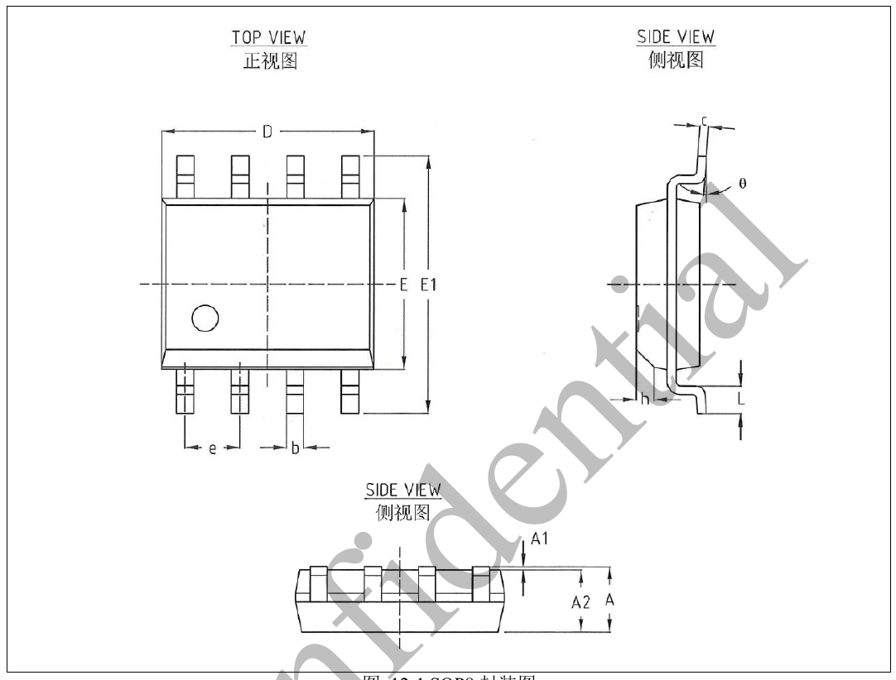
**Package Type:** SOP8 (Small Outline Package, 8-pin)

**Dimension Table:**

| Symbol | Parameter | Min (mm) | Typ (mm) | Max (mm) |
|--------|-----------|----------|----------|----------|
| A | Package Height | - | - | 1.80 |
| A1 | Standoff | 0.05 | - | 0.25 |
| A2 | Body Height | 1.25 | - | 1.60 |
| b | Lead Width | 0.35 | - | 0.50 |
| c | Lead Thickness | 0.19 | - | 0.25 |
| D | Package Length | 4.80 | 4.90 | 5.00 |
| E | Package Width | 3.80 | 3.90 | 4.00 |
| E1 | Body Width with Leads | 5.80 | 6.00 | 6.20 |
| e | Pin Pitch | 1.27 BSC | 1.27 BSC | 1.27 BSC |
| L | Lead Length | 0.40 | - | 1.00 |
| h | Chamfer | 0.30 | - | 0.50 |
| Ø | Lead Angle | 0° | - | 8° |

**Notes:**
- BSC = Basic dimension (exact value)
- All dimensions are in millimeters
- Package material: Plastic molded
- Lead finish: Tin (Sn) plated
- Moisture sensitivity level: Check datasheet
- RoHS compliant

**Pin Numbering:**

### 13.2 SOT23-8 Package

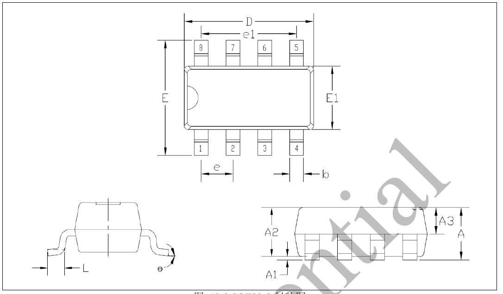
**Package Type:** SOT23-8 (Small Outline Transistor, 8-pin)

**Dimension Table:**

| Symbol | Parameter | Min (mm) | Typ (mm) | Max (mm) |
|--------|-----------|----------|----------|----------|
| A | Package Height | - | - | 1.33 |
| A1 | Standoff | 0.00 | - | 0.085 |
| A2 | Body Height | 1.15 | 1.20 | 1.25 |
| A3 | Lead Height | 0.60 | 0.65 | 0.70 |
| b | Lead Width | 0.35 | - | 0.38 |
| D | Package Length | 3.20 | 3.25 | 3.30 |
| E | Package Width | 2.80 | 2.90 | 3.00 |
| E1 | Body Width | 1.55 | 1.60 | 1.65 |
| e | Pin Pitch | 0.775 | 0.80 | 0.825 |
| e1 | Body Pitch | 2.375 | 2.40 | 2.425 |
| L | Lead Length | 0.40 | 0.41 | 0.42 |
| Ø | Lead Angle | 0° | - | 8° |

**Notes:**
- All dimensions are in millimeters
- Package material: Plastic molded
- Lead finish: Tin (Sn) plated
- Smaller footprint than SOP8
- RoHS compliant

### 13.3 Package Selection Guide

**SOP8 Package:**
- **Advantages:**
  - Easier hand soldering
  - Better thermal performance
  - More robust mechanical strength
  - Easier to inspect solder joints

- **Applications:**
  - Prototype development
  - Hand assembly
  - Applications requiring better heat dissipation

**SOT23-8 Package:**
- **Advantages:**
  - Smaller PCB footprint
  - Lower cost
  - Better for high-density designs
  - Suitable for automated assembly

- **Applications:**
  - Mass production
  - Space-constrained designs
  - Cost-sensitive applications
  - Automated SMT assembly

**PCB Land Pattern:**
- Follow IPC-7351 standard for land pattern design
- Consult package outline drawings for recommended footprint
- Allow adequate clearance for component placement and routing
- Consider solder mask and paste mask requirements

---

## 14. Abbreviations and Acronyms

| Abbreviation | Full Term | Description |
|--------------|-----------|-------------|
| ACK | Acknowledgment | Confirmation signal sent by receiver to transmitter |
| ADC | Analog-to-Digital Converter | Converts analog signals to digital values |
| AGC | Automatic Gain Control | Maintains consistent signal strength |
| ARC | Auto Retransmit Count | Number of automatic retransmission attempts |
| ARD | Auto Retransmit Delay | Delay between retransmission attempts |
| BLE | Bluetooth Low Energy | Low-power wireless technology standard |
| BSC | Basic Dimension | Exact dimension value (not a tolerance range) |
| CAD | Channel Activity Detection | Detects whether channel is occupied |
| Chirp | Chirp Signal | Linear frequency modulated signal |
| CI | Coding Indicator | Indicates spread spectrum coding used |
| CRC | Cyclic Redundancy Check | Error-detection code |
| CSN | Chip Select Not | SPI chip select signal (active low) |
| DAC | Digital-to-Analog Converter | Converts digital values to analog signals |
| DCDC | DC-to-DC Converter | Voltage converter circuit |
| FEC | Forward Error Correction | Error correction technique |
| FIFO | First In First Out | Data buffer structure |
| GFSK | Gaussian Frequency Shift Keying | Digital modulation technique |
| GPIO | General Purpose Input/Output | Configurable digital I/O pin |
| I2C | Inter-Integrated Circuit | Two-wire serial communication protocol |
| IC | Integrated Circuit | Electronic chip/semiconductor device |
| IO | Input/Output | Data transfer interface |
| IOMUX | Input/Output Multiplexing | Sharing pins for multiple functions |
| IRQ | Interrupt Request | Signal indicating event requiring attention |
| LDO | Low-Dropout Regulator | Linear voltage regulator |
| LE | Low Energy | Bluetooth Low Energy designation |
| LPF | Low-Pass Filter | Filters out high-frequency signals |
| LQI | Link Quality Indicator | Measure of communication link quality |
| LSB | Least Significant Bit | Lowest-order bit in binary number |
| MAC | Media Access Control | Data link layer protocol |
| MCU | Microcontroller Unit | Microprocessor with integrated peripherals |
| Mixer | Mixer | RF circuit combining two frequencies |
| Modem | Modulator-Demodulator | Converts between analog and digital signals |
| MSB | Most Significant Bit | Highest-order bit in binary number |
| NC | Not Connected | Pin or component not connected |
| OSC | Oscillator | Circuit generating periodic signal |
| PA | Power Amplifier | Amplifies RF signal for transmission |
| PCB | Printed Circuit Board | Board with electronic component connections |
| PID | Packet Identifier | Identifies packets for duplicate detection |
| PLL | Phase-Locked Loop | Frequency synthesis circuit |
| PMU | Power Management Unit | Controls power supply and distribution |
| POR | Power-On Reset | Reset circuit activated at power-up |
| PRX | Primary Receiver | Main receiving device |
| PTX | Primary Transmitter | Main transmitting device |
| R/W | Read/Write | Register access permissions |
| RAM | Random Access Memory | Volatile data storage |
| RF | Radio Frequency | Electromagnetic wave frequencies |
| RoHS | Restriction of Hazardous Substances | Environmental compliance standard |
| RSSI | Received Signal Strength Indicator | Measure of received signal power |
| RX | Receive/Receiver | Reception or receiving device |
| SCK | Serial Clock | SPI clock signal |
| SCL | Serial Clock Line | I2C clock signal |
| SDA | Serial Data Line | I2C data signal |
| SF | Spreading Factor | Spread spectrum parameter |
| SMT | Surface Mount Technology | Component mounting technique |
| SOP | Small Outline Package | IC package type |
| SOT | Small Outline Transistor | IC package type |
| SPI | Serial Peripheral Interface | Synchronous serial communication protocol |
| STB | Standby | Low-power waiting state |
| Sync | Synchronization | Timing alignment |
| TX | Transmit/Transmitter | Transmission or transmitting device |
| VCO | Voltage-Controlled Oscillator | Oscillator with frequency controlled by voltage |
| VDD | Positive Supply Voltage | Main power supply pin |
| VSS | Ground/0V Reference | Ground connection |

---

## 15. Revision History

| Version | Date | Content |
|---------|------|---------|
| V1.0 | 2024.09 | Initial version |
| V1.1 | 2024.11 | Updated reference schematic, supplemented register default values, corrected typos |
| V1.2 | 2025.01 | Updated electrical characteristics, updated ordering information, optimized document descriptions |
| V1.3 | 2025.02 | Updated reference schematic |
| V1.4 | 2025.03 | Added SOT23-8 package, updated Figure 6-1, updated P_RX,MAX value, updated values in section 8.3.3 |
| V1.5 | 2025.05 | Optimized register descriptions |
| V1.6 | 2025.11 | Corrected typos |

---

## 16. Document Information

This is a translation from the original PDF version:

**Document Purpose:**
This reference manual provides comprehensive technical information for engineers implementing drivers and applications for the PAN211x series 2.4GHz transceiver chips. It covers all aspects of operation including RF characteristics, protocol specifications, register programming, and electrical specifications.

**Target Audience:**
- Hardware engineers designing PAN211x-based systems
- Firmware engineers developing device drivers
- Application engineers integrating PAN211x into products
- Technical support personnel

**Related Documents:**
- PAN211x Datasheet (detailed electrical specifications)
- Application Notes for specific use cases
- SDK documentation
- Development kit user guides

**Disclaimer:**
All or part of the products, services, or features described in this document may not be within your purchase or use scope. Unless otherwise stipulated in the contract, Panchip Microelectronics Co., Ltd. makes no express or implied statements or warranties regarding the content of this document.

**Trademark Notice:**
Panchip is a trademark of Panchip Microelectronics Co., Ltd. Other names mentioned in this document are trademarks/registered trademarks of their respective owners.

**Contact Information:**
- Company: Shanghai Panchip Microelectronics Co., Ltd. (上海磐启微电子有限公司)
- Address: Room 302, Building D, No. 666 Shengxia Road, Zhangjiang Hi-Tech Park, Pudong New Area, Shanghai, China
- Phone: 021-50802371
- Website: http://www.panchip.com

---

**End of Reference Manual**

